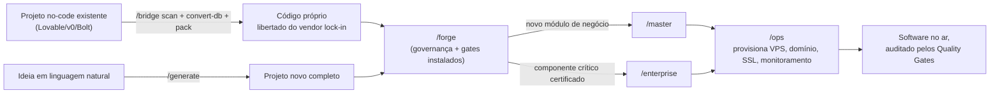

# O Ecossistema AIDD explicado: as 6 ferramentas e como elas se encaixam

> Documento de referência. Gerado em 2026-09-10 a partir do estado real do repositório (`AGENTS.md` §1 e §3, e dos `README.md` de cada `tools/<ferramenta>`).

## A ideia em uma frase

O Ecossistema AIDD é uma linha de produção de software: cada ferramenta é uma estação de trabalho especializada, todas seguindo as mesmas regras de qualidade (os "gates"), e você aciona cada uma digitando um comando simples (`/forge`, `/generate`, `/master`, `/enterprise`, `/bridge`) ou, no caso do Ops, pelo orquestrador do ecossistema. Nenhuma delas depende de decorar comandos Python — o slash command já traduz sua frase em linguagem natural para a ação certa.

---

## 1. AIDD Forge — o instalador de governança

**Comando:** `/forge [caminho]`
**Onde mora:** `tools/aidd-forge`

**Analogia:** é o eletricista que vem instalar o quadro de disjuntores num prédio novo — ou até num prédio antigo que nunca teve. Depois que ele passa, o prédio (o projeto) tem regras de segurança, e qualquer obra futura precisa respeitar esse quadro.

**O que faz de fato:**
- Injeta em qualquer projeto (novo ou já existente, AIDD ou não) a infraestrutura de governança: os Quality Gates, os otimizadores de token e as convenções que fazem o projeto funcionar do mesmo jeito em qualquer harness de IA (Claude Code, Cursor, OpenCode, etc.).
- Cria micro-ambientes isolados por fase de trabalho, para que um subagente só veja o pedaço do projeto que precisa (evita gastar contexto/token à toa).
- Roda 100% por script determinístico — não chama IA para decidir nada disso.

**Exemplo de dia a dia:** você herdou um projeto legado do time de vendas, sem nenhum padrão de qualidade automatizado. Você roda `/forge .` na raiz dele. Em poucos segundos o projeto ganha os gates de qualidade e a estrutura de governança — a partir de agora, qualquer entrega malfeita é barrada automaticamente antes do commit, mesmo sem você revisar linha por linha.

---

## 2. AIDD Generator — a fábrica que parte de uma ideia

**Comando:** `/generate <ideia>`
**Onde mora:** `tools/aidd-generator`

**Analogia:** é a fábrica que recebe um desenho no guardanapo ("quero um app de agendamento pra salão de beleza") e devolve o produto pronto: banco de dados, testes, documentação e, se pedido, o código funcionando.

**O que faz de fato:**
- Roda um pipeline de 7 a 8 fases que transforma uma frase em linguagem natural em um projeto de software completo (schemas, scripts, testes, documentação).
- Pode gerar código funcional de verdade usando IA (modo delegado, aproveitando a sessão do agente já logado — sem precisar de chave de API extra) ou rodar sozinho sem LLM nenhum (modo headless/determinístico) para as partes mecânicas.
- Cada fase purga o contexto da fase anterior — o "trabalhador" da fase 3 não carrega bagagem da fase 1, o que mantém o custo de token baixo mesmo em projetos grandes.

**Exemplo de dia a dia:** um cliente pede "um sistema simples de controle de estoque para minha loja de roupas, com alerta quando o produto está acabando". Você digita `/generate sistema de controle de estoque para loja de roupas com alerta de estoque baixo`. Em minutos, o pipeline entrega a estrutura completa do projeto — modelos de dados, regras de negócio, testes e documentação — pronta para revisão, sem você escrever a primeira linha manualmente.

---

## 3. AIDD Master — o construtor de módulos de negócio

**Comando:** `/master <modulo>`
**Onde mora:** `tools/aidd-master`

**Analogia:** se o Generator constrói o prédio inteiro do zero, o Master é o time que chega depois e constrói um cômodo novo dentro de um prédio que já existe — mantendo o mesmo padrão de fundação, encanamento e elétrica do resto do prédio.

**O que faz de fato:**
- Cria uma "fatia vertical" de negócio nova (`src/modules/<modulo>/`) já com rotas, modelos, serviços, interface e testes — tudo isolado dos outros módulos, mas seguindo a mesma arquitetura (Clean Architecture).
- Suporta banco de dados SQLite (modo concorrente WAL), PostgreSQL ou Supabase, trocando por baixo do capô sem o módulo precisar saber qual é.
- Documenta a API automaticamente (Swagger/OpenAPI) e já nasce com observabilidade (métricas de performance prontas).

**Exemplo de dia a dia:** seu sistema de estoque (gerado pelo Generator) está funcionando, mas agora você precisa adicionar um módulo de "relatórios financeiros" que ainda não existe. Você roda `/master relatorios-financeiros`. A ferramenta cria o módulo inteiro — models, serviços, rotas, tela e testes — já plugado e coerente com o restante do sistema, sem duplicar código nem quebrar os outros módulos.

---

## 4. AIDD Enterprise — o cofre de componentes certificados

**Comando:** `/enterprise <tipo> <nome>`
**Onde mora:** `tools/aidd-enterprise`

**Analogia:** é o fornecedor de peças com certificado de qualidade (tipo uma peça de avião com laudo técnico anexado) — em vez de fabricar uma peça nova toda vez, você pega uma já testada e auditada, com um "lacre" (hash SHA-256) provando que ninguém alterou ela no caminho.

**O que faz de fato:**
- Injeta componentes prontos e certificados (ex.: autenticação JWT, camada de segurança, integrações) validando um hash SHA-256 contra o que foi certificado — se o arquivo foi adulterado, o hash não bate e a injeção é bloqueada.
- Aplica princípios de Zero-Trust: nada é confiado só porque "está no repositório", tudo é conferido antes de entrar.
- Usa a mesma base arquitetural do Master (fatias verticais, Clean Architecture), mas com a camada extra de auditoria/certificação — é o irmão "missão crítica" do Master.

**Exemplo de dia a dia:** o sistema de estoque agora vai processar dados de cartão de pagamento, e você precisa de uma camada de autenticação robusta, não uma implementação caseira. Você roda `/enterprise auth jwt-service`. A ferramenta injeta o componente de autenticação já certificado, confere o hash de integridade e só libera se tudo bater — evitando que você (ou uma IA apressada) reinvente uma autenticação vulnerável na mão.

---

## 5. AIDD Bridge — o libertador de projetos no-code

**Comando:** `/bridge [comando]` (subcomandos: `scan`, `convert-db`, `merge`, `pack`)
**Onde mora:** `tools/aidd-bridge`

**Analogia:** é o despachante que tira seu carro importado de um "leasing" com letras miúdas (a plataforma no-code, tipo Lovable/v0/Bolt) e transfere o documento pra seu nome — o carro continua o mesmo, mas agora é realmente seu, roda em qualquer oficina (VPS própria) e não depende mais do dono original.

**O que faz de fato, em 4 etapas:**
1. **`scan`** — inspeciona um projeto React + Vite + Tailwind + Supabase (típico de Lovable/Bolt) e mapeia páginas, componentes e banco de dados num manifesto.
2. **`convert-db`** — converte o banco Supabase (que só roda na nuvem deles) para PostgreSQL puro, mantendo o app funcionando sem precisar reescrever o código que fala com o banco.
3. **`merge`** — se você tem 2 ou mais desses apps soltos, funde tudo num monorepo único e organizado.
4. **`pack`** — empacota tudo em Docker, com HTTPS automático, pronto pra subir numa VPS que é sua, não da plataforma.

**Exemplo de dia a dia:** você prototipou um app de agendamentos no Lovable, ele ficou bom, mas agora a fatura mensal da plataforma está pesando e você quer rodar isso no seu próprio servidor. Você roda `python ecossistema.py bridge scan ./meu-app-lovable`, depois `convert-db` para tirar a dependência do Supabase, e por fim `pack` para gerar o Docker Compose com certificado SSL. Resultado: o mesmo app, agora rodando 100% na sua VPS, sem mensalidade de plataforma.

---

## 6. AIDD Ops — o meta-orquestrador de infraestrutura

**Status:** MVP funcional — orquestra stacks self-hosted via `/ops` ou diretamente pela CLI do ecossistema.
**Onde mora:** `tools/aidd-ops`

**Analogia:** é o gerente de obra que, depois que a casa (o software) está pronta, cuida de ligar água, luz, internet e monitoramento — ou seja, sobe a infraestrutura real (servidor, domínio, monitoramento) sem você precisar configurar cada peça manualmente.

**O que faz de fato:**
- Recebe um requisito de negócio em linguagem natural e orquestra o provisionamento de uma stack self-hosted completa: Traefik (proxy/roteamento), Authentik (login/identidade), Next.js, PostgreSQL, e microsserviços em Docker.
- É pensado como alternativa própria e "de marca branca" a plataformas de terceiros (tipo GoHighLevel), sem limite artificial de contatos nem sobretaxa de envio de mensagens.
- Já traz monitoramento real via Uptime Kuma (não dashboard fake) e hardening de servidor via Ansible.

**Exemplo de dia a dia (uso já funcional hoje):** você terminou o sistema de agendamentos e precisa colocá-lo no ar com domínio próprio, HTTPS, login de usuários e um painel que avisa se o servidor cair. Em vez de configurar Traefik, Authentik e monitoramento um por um manualmente, o Ops recebe o pedido e provisiona essa stack inteira de forma coordenada — hoje isso já cobre o levantamento do requisito (intake) e o dimensionamento da stack; o restante do pipeline ainda está sendo construído.

---

## Como o ecossistema funciona como um todo

As 6 ferramentas não são silos separados — elas compartilham 3 coisas:

1. **Uma única porta de entrada:** `python ecossistema.py <ferramenta> <ação>` (ou o slash command equivalente). Você nunca precisa saber qual script Python interno cada ferramenta usa por baixo.
2. **Os mesmos Quality Gates:** antes de qualquer commit, um conjunto de verificações automáticas (gates em `gates/`) audita o resultado de qualquer ferramenta — segurança, testes reais rodando (não simulados), ausência de credenciais vazadas, consistência entre as 5-6 ferramentas, honestidade nas mensagens de aprovação. Se um gate reprova (exit 1), a entrega é bloqueada — não existe "quase aprovado".
3. **A mesma regra de economia de token e transparência:** todo estado fica em arquivo (JSON/SQLite), nunca só na memória da conversa, e cada execução isolada (subagente) purga o contexto ao terminar.

Ou seja: cada ferramenta resolve uma etapa diferente do ciclo de vida de um software, mas todas prestam contas ao mesmo "fiscal de qualidade".

### Fluxo típico entre as ferramentas

---

## Exemplo completo: um caso de uso do ecossistema inteiro

Cenário: uma dona de salão de beleza já tinha testado um app de agendamentos feito no Lovable, gostou do resultado, mas quer parar de pagar a mensalidade da plataforma e ainda adicionar funções novas com segurança de verdade.

1. **`/bridge scan` → `/bridge convert-db` → `/bridge pack`** — o app do Lovable é extraído, o banco Supabase vira PostgreSQL puro, e tudo é empacotado em Docker com HTTPS. Ela já não depende mais da plataforma original.
2. **`/forge .`** — na raiz do projeto libertado, instala-se a governança e os Quality Gates. A partir daqui, toda mudança futura é auditada automaticamente.
3. **`/master fidelidade`** — ela quer um módulo novo de pontos de fidelidade para clientes recorrentes. O Master cria esse módulo inteiro (modelo, regras, tela, testes), plugado ao resto do sistema sem quebrar o que já existia.
4. **`/enterprise auth jwt-service`** — como o sistema agora guarda dados sensíveis de clientes, ela injeta um componente de autenticação certificado (hash conferido), em vez de uma implementação caseira.
5. **`/ops`** — por fim, a stack real é provisionada: domínio próprio, HTTPS automático, login de usuários via Authentik e um painel de monitoramento avisando se o servidor cair.

No fim, o mesmo app que nasceu como protótipo em uma plataforma de terceiros termina rodando 100% sob controle dela, com segurança certificada, um módulo de negócio novo e infraestrutura própria — e cada etapa desse caminho foi auditada pelos mesmos gates de qualidade, sem depender de revisão manual linha a linha.
