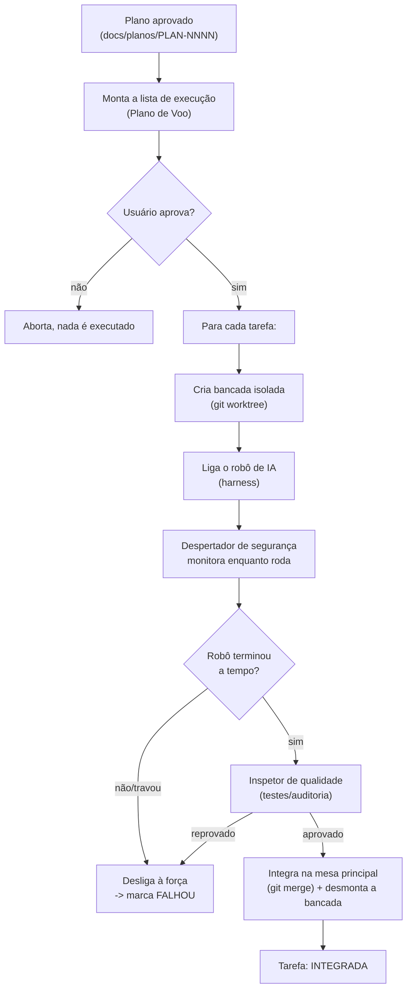

# Como funciona a orquestração do ORCA neste ecossistema

> Documento de referência. Gerado em 2026-09-11 a partir do código real do motor
> (`componentes/compartilhado/skills/orca-plan-orchestrator/scripts/*.py`) e das
> skills `orchestrate` (roteador) e `orca-plan-orchestrator` (motor da via Git
> Worktree nativo) — não é um resumo de intenção, é leitura linha a linha do que
> o código faz hoje.

## A ideia em uma frase

Pensa num restaurante com várias bancadas de cozinha isoladas. Cada tarefa do
plano vira um prato: um cozinheiro (o robô de IA) trabalha sozinho na sua
bancada isolada (uma cópia separada da pasta do projeto), um inspetor prova o
prato antes de deixar sair (os testes automáticos), e só depois de aprovado o
prato vai pra mesa principal (o código real do projeto). Se o cozinheiro
travar ou demorar demais, um despertador de segurança desliga a bancada dele.
Isso é a orquestração: várias tarefas rodando isoladas, cada uma auditada
antes de entrar no projeto principal.

---

## Antes de tudo: de onde vem o plano

`/orchestrate` nunca é o primeiro passo. O fluxo do ecossistema tem 3 etapas,
e cada uma para para o humano aprovar antes da próxima:

| Etapa | Comando | Entrega | Parada obrigatória |
|---|---|---|---|
| 1 | `/melhoria <pedido>` | um relatório com o diagnóstico do que precisa mudar | "quer que eu gere o plano?" |
| 2 | `/plan <nome>` | uma pasta `docs/planos/PLAN-NNNN-nome/` com as tarefas já escritas em rascunho | "aprova este plano?" |
| 3 | `/orchestrate <plano>` | execução real das tarefas | escolha do ambiente + aprovação da lista de execução |

Nenhuma etapa dispara a seguinte sozinha — é sempre um humano que decide
avançar.

---

## O primeiro gate: qual ambiente vai executar

Quando você chama `/orchestrate`, a primeira pergunta é sempre "onde isso vai
rodar?". Existem 3 opções, e cada uma é um motor diferente por baixo:

| Ambiente | Analogia | Isolamento de arquivo |
|---|---|---|
| **1) ORCA (app real)** | usar uma sala de reunião de verdade, com porta, dentro do escritório (app ORCA instalado) | Sim |
| **2) Subagentes** | pedir pra um colega ajudar sentado na sua própria mesa, sem sala separada | **Não** — quem tocar no mesmo arquivo pode pisar no trabalho do outro |
| **3) Git Worktree nativo** | montar uma bancada avulsa na hora, sem precisar do prédio (app ORCA) inteiro | Sim |

Este documento detalha a **via 3 (Git Worktree nativo)**, porque é a única
com um motor de código de verdade neste repositório — as outras duas só
preparam uma lista de instruções (JSON) e entregam a execução pro app ORCA ou
pro assistente da sessão.

---

## O motor real, passo a passo

### 1. Ler o plano

Cada tarefa do plano é um arquivo `NN-nome.md` dentro da pasta do plano. O
motor lê todos, ordena pelo número, e de cada um extrai só o essencial — o
que precisa ser feito e o critério de "pronto" — nunca o arquivo inteiro (é
como entregar pro cozinheiro só a receita, não o livro de culinária inteiro).
Cada tarefa ganha um nome curto e único, tipo `PLAN-0016-fase-04-...`, pra
nunca confundir qual tarefa é de qual plano.

### 2. Montar a lista de execução (Plano de Voo)

Pra cada tarefa, o motor decide: qual robô de IA vai executar (claude, mimo,
opencode ou agy) e qual comando exato liga esse robô. Isso é **montagem
mecânica de texto** — nenhuma IA é chamada pra decidir isso, é só juntar
pedaços de um catálogo de robôs (`.orca/harness_profiles.json`). O resultado
é uma tabela mostrando cada tarefa, seu robô e seu comando.

### 3. Pedir aprovação

Antes de tocar em qualquer arquivo de verdade, o motor mostra essa tabela e
espera você confirmar. Sem confirmação, nada roda.

### 4. Guardar um quadro de status

O motor mantém um arquivo (`.orca/.orca_state.json`) com a situação de cada
tarefa, como um quadro de kanban:

```
esperando → rodando → aprovado no teste → integrado no projeto
                    ↘ falhou
         pausado (limite de uso)
```

Se o processo cair no meio (queda de luz, fechou o terminal), esse quadro
permite retomar depois: tarefas já integradas são puladas, tarefas que
tinham passado no teste só precisam ser integradas, e tarefas que estavam
rodando ou falharam são reiniciadas do zero — não existe "continuar de onde
parou" no meio de uma tarefa, porque não dá pra saber com segurança o que um
robô de terceiros já tinha feito na cabeça dele. Antes de reiniciar, o motor
limpa qualquer bancada suja deixada pela tentativa anterior (e desliga à
força o processo antigo, se ele ainda estiver de pé).

### 5. Para cada tarefa: bancada isolada → robô → inspetor → integração

Esta é a parte central, repetida uma vez por tarefa:

1. **Monta a bancada isolada** — cria uma cópia de trabalho separada da pasta
   do projeto, com seu próprio histórico paralelo (comando real:
   `git worktree add`, que gera uma pasta nova e uma "linha do tempo"
   provisória só daquela tarefa).
2. **Copia as configurações locais** (tipo senhas em `.env`) pra dentro da
   bancada, porque uma cópia nova normalmente não vem com esses arquivos.
3. **Liga o robô de IA.** Como esses robôs abrem uma tela interativa que
   demora a carregar, o motor espera ~10 segundos e só depois "digita" a
   instrução pra ele — literalmente escreve na entrada de texto do programa,
   como se uma pessoa estivesse digitando na hora.
4. **Fica de olho com um despertador de segurança** enquanto o robô
   trabalha: se passar de 30 minutos no total, ou 5 minutos sem nenhuma
   atividade nova, o motor desliga o robô à força — pra não deixar um
   processo travado rodando pra sempre e consumindo recursos.
5. **Salva automaticamente** o que o robô mudou na bancada.
6. **Passa pelo inspetor de qualidade** — o motor olha quais arquivos
   mudaram e decide quais testes rodar (testes daquela ferramenta específica,
   ou a auditoria geral do projeto). Só é aprovado se **todos** os testes
   relevantes passarem sem erro nenhum — não existe "quase aprovado".
7. **Se aprovado:** o trabalho é juntado na mesa principal (`git merge`) e a
   bancada isolada é desmontada (`git worktree remove` + apaga a linha do
   tempo provisória).
8. **Se reprovado:** a tarefa fica marcada como falha, e nada é integrado —
   o projeto principal fica protegido.

Todo esse histórico fica registrado em `.orca/logs/` e `.orca/reports/`, como
uma caixa-preta de cada tarefa, útil pra auditar depois o que realmente
aconteceu.

---

## Diagrama do fluxo



---

## Comandos que você usa no dia a dia

```bash
# só mostra a lista de execução, não mexe em nada ainda (zero custo de token)
python ecossistema.py orchestrate <plano> --ambiente gitworktree --dry-run

# roda de verdade, perguntando o robô por tarefa
python ecossistema.py orchestrate <plano> --ambiente gitworktree

# um robô fixo pra todas as tarefas, sem perguntar
python ecossistema.py orchestrate <plano> --ambiente gitworktree --harness claude --yes

# um robô diferente por tarefa
python ecossistema.py orchestrate <plano> --ambiente gitworktree --harness-map frente1=claude,frente2=mimo

# retomando depois de uma queda de energia/interrupção
python ecossistema.py orchestrate <plano> --ambiente gitworktree --resume --yes
```

Antes da execução real começar, o CLI move fisicamente a pasta do plano pra
`docs/planos/fazendo/<nome>` — isso só acontece no instante exato em que o
trabalho de verdade começa, nunca durante o `--dry-run`.

---

## O que fica registrado (para auditoria)

| Arquivo | O que é |
|---|---|
| `.orca/.orca_state.json` | o quadro de status de cada tarefa |
| `.orca/memory.md` | a mesma informação, em formato de tabela legível |
| `.orca/logs/<tarefa>.log` | tudo que o robô "disse" durante a execução |
| `.orca/reports/<tarefa>.json` | veredito final: passou, código de saída, motivo |

---

## Exemplo completo de uma rodada real

Cenário: um plano `PLAN-0016` tem 3 tarefas pendentes — corrigir um bug de
timing, adicionar um teste novo e ajustar a documentação.

1. Você roda `python ecossistema.py orchestrate docs/planos/PLAN-0016-... --ambiente gitworktree`.
2. O motor lê as 3 tarefas, monta a lista de execução (por padrão pergunta um
   robô por tarefa) e mostra a tabela.
3. Você confirma. O plano é movido pra `docs/planos/fazendo/`.
4. Tarefa 1 ganha sua bancada isolada, o robô escolhido corrige o bug, o
   inspetor roda os testes daquela ferramenta — passam — e o código é
   integrado na branch principal. Bancada desmontada.
5. Tarefa 2 segue o mesmo caminho, mas o teste novo que o robô escreveu falha
   no inspetor — a tarefa fica marcada como FALHOU, nada é integrado, e você
   é quem decide o próximo passo (corrigir manualmente, tentar de novo,
   pular).
6. Tarefa 3 roda em paralelo (ou em sequência, dependendo do modo) e é
   aprovada e integrada normalmente.
7. No fim, `.orca/memory.md` mostra 2 tarefas integradas e 1 com falha —
   nenhuma suposição, é o estado real deixado pelo motor.

---

## Nota técnica: um bug encontrado ao ler o código

Em `orchestrator_engine.py`, no modo interativo (que é o padrão hoje), o
motor tenta guardar o "crachá" do processo do robô (`os.getpid()`) pra poder
desligá-lo à força depois — mas o arquivo nunca importa o módulo `os` no
topo. Isso quebra com um erro assim que uma tarefa roda no modo padrão. É um
conserto de uma linha (`import os`), ainda pendente neste repositório.
