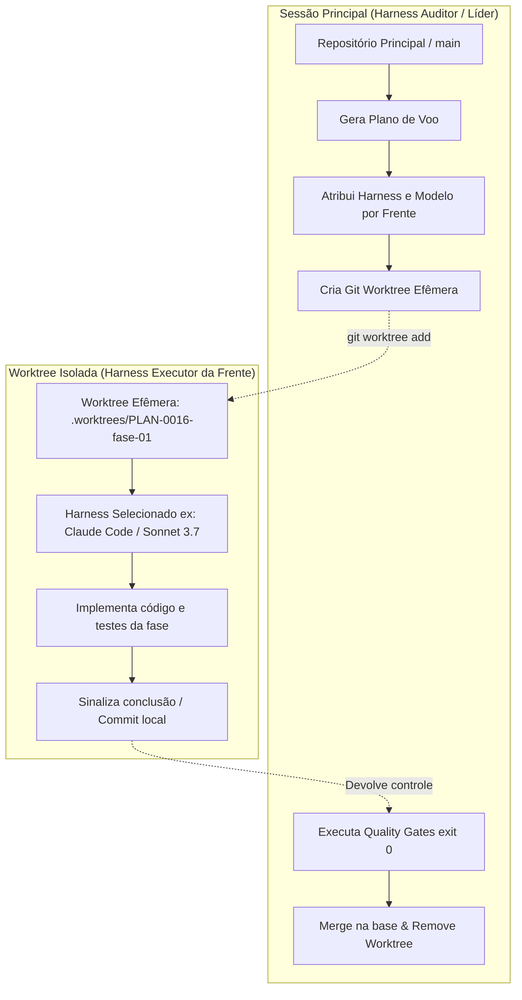

# 🌳 Guia de Orquestração com Git Worktree Nativo (Git Ork 3 / ORCA)

> **Documento:** `docs/explicacoes/11-09-2026_explica-orquestracao-git-worktree-nativo.md`  
> **Data:** 11/09/2026  
> **Status:** Em Produção (Ecossistema AIDD / ORCA ADE)  
> **Público:** Desenvolvedores, Engenheiros de Software e Harnesses Autônomos

---

## 1. Visão Geral da Arquitetura

Na orquestração por **Git Worktree Nativo**, o desenvolvimento modular (paralelo ou sequencial) é executado com **isolamento estrito de sistema de arquivos**, eliminando conflitos de branch, contaminação de dependências e saturação de contexto de LLMs.

### O Modelo Dual: Harness Auditor vs. Harness Executor



1. **Harness Líder / Auditor (Sessão Principal):**
   - Permanece no branch base (`main` ou branch da feature).
   - Analisa o plano (`docs/planos/PLAN-<NNNN>-<nome>`).
   - Pergunta ao usuário qual harness e qual modelo executará cada fase.
   - Compila o **Plano de Voo**.
   - Cria as worktrees e os branches efêmeros.
   - **Auditoria Rígida:** Quando o executor termina, o Auditor roda os Quality Gates locais (`gates/G_*.py` e testes).
   - Se aprovado (exit 0), faz o merge e limpa a worktree. Se reprovado, bloqueia.

2. **Harness Executor (Worktree Efêmera):**
   - Opera em uma pasta separada no disco criada via `git worktree add`.
   - Executa com contexto 100% focado exclusivamente na sua fase (`NN-<item>.md`).
   - Pode ser qualquer harness instalado (`claude`, `agy`, `opencode`, `mimo`, `gemini`, `cursor`) acoplado ao modelo de preferência.

---

## 2. Padrão de Nomenclatura Estrito

Para evitar colisões e permitir rastreabilidade total:

- **Plano:** `PLAN-<NNNN>-<nome-curto>` (ex.: `PLAN-0016-qualidade-testes-mutacao`).
- **Fase / Mesa:** `PLAN-<NNNN>-fase-<NN>-<nome-curto>` (ex.: `PLAN-0016-fase-01-isolamento-bd`).
  - Sempre dois dígitos na fase (`fase-01`, `fase-02`, ..., `fase-10`).
- **Branch Efêmero:** `orca/<nome-da-mesa>` (ex.: `orca/PLAN-0016-fase-01-isolamento-bd`).
- **Diretório da Worktree:** `.worktrees/<nome-da-mesa>` ou raiz configurada.

---

## 3. Passo a Passo Completo da Orquestração

### Passo 1: Inspeção e Preparação do Plano

O plano fatiado reside em `docs/planos/PLAN-<NNNN>-<nome>/` contendo:
- `00-PROCESSO-E-DECISOES.md`
- `01-fase-um.md`
- `02-fase-dois.md`

O harness auditor faz a verificação inicial e dry-run:
```powershell
python ecossistema.py orchestrate docs/planos/PLAN-0016-qualidade-testes-mutacao --dry-run
```

---

### Passo 2: Mapeamento Interativo de Harness e Modelo por Fase

O auditor pergunta interativamente ao desenvolvedor qual par **[Harness / Modelo]** deve ser usado para cada frente.

**Exemplo de Seleção:**

| Fase | Título | Harness Escolhido | Modelo Definido | Justificativa |
| :--- | :--- | :--- | :--- | :--- |
| **01** | Refatoração de Banco | `claude` | `claude-3-7-sonnet` | Raciocínio arquitetural profundo |
| **02** | Criação de Testes Unitários | `agy` (Antigravity) | `gemini-2.5-pro` | Ampla janela de contexto e velocidade |
| **03** | Configuração de CI/CD | `opencode` | `gpt-4o` | Automação concisa de scripts |

No ecossistema AIDD, isso pode ser passado via linha de comando ou gerado interativamente:
```powershell
python ecossistema.py orchestrate docs/planos/PLAN-0016-qualidade-testes-mutacao `
  --ambiente gitworktree `
  --harness-map "fase-01=claude:claude-3-7-sonnet,fase-02=agy:gemini-2.5-pro" `
  --dry-run
```

---

### Passo 3: Criação da Worktree Nativa pelo Harness Auditor

O harness auditor prepara o ambiente isolado para a fase ativa:

```powershell
# 1. Garantir que a base está limpa e atualizada
git status

# 2. Criar a worktree vinculada ao branch efêmero orca
git worktree add -b orca/PLAN-0016-fase-01-isolamento-bd .worktrees/PLAN-0016-fase-01-isolamento-bd HEAD

# 3. Listar as worktrees ativas para conferência
git worktree list
```

---

### Passo 4: Inicialização do Harness Executor na Worktree

O harness executor é inicializado **dentro da pasta da worktree criada**, recebendo o prompt focado daquela fase:

#### Opção A: Execução via Claude Code com modelo específico
```powershell
cd .worktrees/PLAN-0016-fase-01-isolamento-bd
claude --model claude-3-7-sonnet "Execute estritamente o especificado no arquivo docs/planos/PLAN-0016-qualidade-testes-mutacao/01-fase-um.md. Não altere nada fora do escopo desta fase."
```

#### Opção B: Execução via Antigravity CLI (AGY)
```powershell
cd .worktrees/PLAN-0016-fase-01-isolamento-bd
agy --model gemini-2.5-pro "Implemente os requisitos da fase 01 de acordo com as diretrizes do ecossistema."
```

#### Opção C: Execução via OpenCode / Outro CLI
```powershell
cd .worktrees/PLAN-0016-fase-01-isolamento-bd
opencode run --model gpt-4o "Resolva a tarefa da fase 01."
```

Durante esta etapa, o harness executor cria o código, adiciona os testes e commita na branch efêmera:
```powershell
git add .
git commit -m "feat(fase-01): implementa isolamento de banco de dados"
```

---

### Passo 5: Auditoria pelos Quality Gates (Sessão do Líder)

O controle retorna para a sessão do **Harness Auditor** (na raiz do repositório principal).  
Antes de aceitar o código, o Auditor audita a worktree ou o branch efêmero:

```powershell
# Voltar à raiz do repositório principal
cd C:\Users\trcnologia\Desktop\ecossistema-aidd

# Rodar auditoria completa de gates e testes na branch efêmera
python ecossistema.py audit

# Ou inspecionar o diff específico produzido na worktree
git diff HEAD..orca/PLAN-0016-fase-01-isolamento-bd --stat
```

**Regra de Ouro #2 (Qualidade Binária):**
- **Exit 0:** Aprovado nos testes e gates de conformidade. Segue para o merge.
- **Exit 1:** Reprovado. O Auditor devolve as pendências para o executor daquela worktree corrigir antes de qualquer merge.

---

### Passo 6: Merge Determinístico e Limpeza da Worktree

Com a aprovação dos gates, o Auditor integra o trabalho e remove o ambiente efêmero:

```powershell
# 1. Merge com fast-forward ou commit estruturado na branch principal
git merge --no-ff orca/PLAN-0016-fase-01-isolamento-bd -m "chore(orca): integra PLAN-0016-fase-01 após validação dos gates"

# 2. Remover a worktree do disco
git worktree remove .worktrees/PLAN-0016-fase-01-isolamento-bd

# 3. Deletar a branch efêmera já integrada
git branch -d orca/PLAN-0016-fase-01-isolamento-bd

# 4. Limpar metadados órfãos do git
git worktree prune
```

---

## 4. Matriz de Comandos Rápidos (Cheat Sheet)

| Ação | Comando | Quem Executa |
| :--- | :--- | :--- |
| **Gerar Plano de Voo** | `python ecossistema.py orchestrate <plano> --dry-run` | Auditor |
| **Criar Worktree** | `git worktree add -b orca/<fase> .worktrees/<fase> HEAD` | Auditor |
| **Listar Worktrees** | `git worktree list` | Auditor / Dev |
| **Rodar Fase (Claude)** | `claude --model <modelo> "<prompt>"` | Executor (dentro da worktree) |
| **Rodar Fase (AGY)** | `agy --model <modelo> "<prompt>"` | Executor (dentro da worktree) |
| **Auditar Alterações** | `python ecossistema.py audit` | Auditor |
| **Integrar (Merge)** | `git merge --no-ff orca/<fase>` | Auditor |
| **Excluir Worktree** | `git worktree remove .worktrees/<fase>` | Auditor |
| **Prune de Worktree** | `git worktree prune` | Auditor |

---

## 5. Benefícios da Abordagem no Ecossistema AIDD

1. **Zero Sobrecarga de Contexto:** Cada harness abre uma sessão limpa contendo apenas os tokens necessários para sua fatia.
2. **Multi-Model Heterogêneo:** Permite usar o modelo com melhor custo-benefício para tarefas braçais (ex.: geração de mocks/testes) e modelos de raciocínio avançado para arquitetura crítica.
3. **Imunidade a Regressão:** Se uma frente falhar ou quebrar os testes, a branch `main` e as outras worktrees permanecem intactas.
4. **Governabilidade Humana:** O desenvolvedor ou o harness líder possui visibilidade total de cada etapa antes da mesclagem definitiva.
