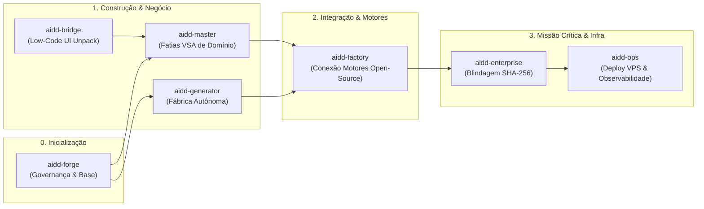

# Ecossistema AIDD — Guia Definitivo das 7 Ferramentas

> **Localização:** `docs/explicacoes/ECOSSISTEMA-FERRAMENTAS-GUIA.md`  
> **Versão:** 2.0.0 (Pós-Refatoração e Alinhamento Arquitetural)  
> **Padrão:** Vertical Slice Architecture (VSA), Determinismo Estrito, Quarteto *Sine Qua Non*.

---

## 1. Visão Geral do Ecossistema

O **Ecossistema AIDD** (Artificial Intelligence Driven Development) é uma suíte de engenharia de software determinística composta por **7 ferramentas especializadas**. Cada ferramenta atua como um elo independente e coordenado de uma esteira industrial de software de alta confiabilidade.

Nenhuma ferramenta concorre com a outra: cada uma possui um **limite de fronteira (bounded context)**, entradas específicas, processos de transformação estritos e entregáveis auditáveis por Quality Gates binários (Exit 0 = Pass / Exit 1 = Block).

```
[ aidd-forge ]      --> Bootstrap, Governança & Blindagem de Repositório
       │
[ aidd-generator ]  --> Fábrica de Software End-to-End (8 Fases: Spec ao Deploy)
       │
[ aidd-master ]     --> Engenharia de Fatias Verticais de Domínio (VSA Pura)
       │
[ aidd-enterprise ] --> Blindagem de Missão Crítica & Componentes Criptográficos
       │
[ aidd-ops ]        --> Infraestrutura, Orquestração VPS, Docker & Observabilidade
       │
[ aidd-factory ]    --> Integração de Motores Open-Source & Fatias VSA Periféricas
       │
[ aidd-bridge ]     --> Desacoplamento & Empacotamento de Low-Code (Lovable/v0/Bolt)
```

---

## 2. O Quarteto *Sine Qua Non* (Pilar Universal)

Toda ferramenta do ecossistema que gera ou evolui código de aplicação deve garantir nativamente a presença e a atualização autônoma de 4 pilares contratuais:

1. **Swagger Studio (`/swagger` ou `/docs` OpenAPI):** Contratos de API REST padronizados, tipados e interativos.
2. **Webhook Studio (`/webhooks`):** Gestão, teste e disparo de eventos assíncronos e assinaturas HMAC.
3. **MCP Studio (`/mcp`):** Exposição nativa de ferramentas e contexto no protocolo Model Context Protocol para consumo agêntico.
4. **Guia/Documentação do Utilizador (`/docs`):** Manuais vivos com fluxos de onboarding, endpoints e integrações.

---

## 3. Detalhamento Ferramenta por Ferramenta

---

### 🛠️ 1. aidd-forge
> **O Fundador e Blindador de Governança**

* **Objetivo da Ferramenta:**  
  Criar a fundação estrutural e a governança inquebrável de qualquer novo repositório ou projeto, estabelecendo regras de lint, convenções git, isolamento de ambiente, gates de pré-commit e documentação canônica antes de qualquer linha de lógica de negócio ser escrita.

* **O que ela realmente faz:**
  * Inspeciona o ambiente local (OS, runtime Python/Node, git hooks).
  * Injeta a árvore de governança canônica (`AGENTS.md`, `CLAUDE.md`, `GEMINI.md`, `rules/`, `docs/protocolos/`).
  * Configura os Quality Gates locais de pré-commit e pré-push que bloqueiam código não conforme.
  * Inicializa repositórios com blindagem contra contaminação de dependências (`.gitignore`, `.editorconfig`, linters determinísticos).

* **O que ela realmente entrega:**
  * Um repositório blindado e padronizado pronto para receber equipes ou agentes de IA.
  * O arquivo `AGENTS.md` canônico e a árvore de diretórios de governança.
  * Relatório de conformidade inicial com aprovação 100% nos Quality Gates de fundação (`G_FORGE_*`).

---

### 🏭 2. aidd-generator
> **A Fábrica Completa de Software Autônoma**

* **Objetivo da Ferramenta:**  
  Construir do zero uma aplicação completa a partir de uma ideia ou especificação textual, executando uma esteira determinística de 8 fases sequenciais sem permitir alucinações ("vibe coding") ou lacunas de implementação.

* **O que ela realmente faz:**
  * **Fase 1 (Intake/Spec):** Converte a intenção do usuário em especificação técnica formal (JSON Schema).
  * **Fase 2 (TDD):** Escreve primeiro a suíte completa de testes unitários e de integração (Red).
  * **Fase 3 (VSA Core):** Gera o código de aplicação estruturado em Fatias Verticais (`routes`, `services`, `repositories`, `models`).
  * **Fase 4 (Quarteto):** Gera dinamicamente Swagger, Webhook Studio, MCP Studio e Guia do Usuário.
  * **Fase 5 a 8 (Auditoria & Entrega):** Executa bateria de testes (Green), refatora, audita segurança e gera manifesto final.

* **O que ela realmente entrega:**
  * Uma aplicação backend/full-stack 100% funcional e testada (Zero Mocks / Zero Stubs).
  * Cobertura de testes reais com execução verificada.
  * Os 4 estúdios do Quarteto *Sine Qua Non* operando dinamicamente.
  * Documentação técnica viva e plano de execução auditado.

---

### 📐 3. aidd-master
> **O Arquiteto Modular de Fatias Verticais (VSA)**

* **Objetivo da Ferramenta:**  
  Projetar, organizar e expandir o núcleo de domínio de aplicações complexas através da arquitetura **Vertical Slice Architecture (VSA)**, eliminando o acoplamento excessivo de camadas horizontais tradicionais (onde uma mudança quebrava controllers, services e repositórios dispersos).

* **O que ela realmente faz:**
  * Organiza cada funcionalidade de negócio em um diretório autônomo (ex: `features/encomendas/`, `features/frotas/`).
  * Cada fatia vertical contém seus próprios contratos, rotas, regras de negócio, persistência e testes.
  * Evita dependências cruzadas circulares e mantém o acoplamento mínimo entre fatias.
  * Injeta e registra automaticamente as novas fatias no roteador central da aplicação.

* **O que ela realmente entrega:**
  * Fatias de domínio isoladas, coesas e testáveis de forma independente.
  * Roteador unificado com registro determinístico de endpoints.
  * Estrutura que permite que múltiplos desenvolvedores ou agentes trabalhem em paralelo em fatias distintas sem conflitos de merge.

---

### 🛡️ 4. aidd-enterprise
> **O Guardião de Missão Crítica & Resiliência**

* **Objetivo da Ferramenta:**  
  Injetar componentes industriais de segurança, resiliência, criptografia e conformidade legal em aplicações já existentes ou em desenvolvimento, garantindo padrões de nível bancário e corporativo.

* **O que ela realmente faz:**
  * Valida a integridade do código usando checksums estritos (**SHA-256**), rejeitando arquivos alterados indevidamente.
  * Injeta componentes padronizados de:
    * **Resiliência:** Circuit Breakers, Retry com Exponential Backoff, Rate Limiting distribuído.
    * **Segurança:** Cofre de segredos (Secrets Manager), sanitização anti-SQL Injection, criptografia em repouso e trânsito.
    * **Auditoria:** Trilha de auditoria imutável (Audit Trail) com logs estruturados e correlação de requisições (`trace_id`).
  * Executa auditorias de vulnerabilidades estáticas de segurança (SAST).

* **O que ela realmente entrega:**
  * Componentes corporativos injetados diretamente no código da aplicação com testes de validação.
  * Relatório formal de auditoria criptográfica e segurança corporativa.
  * Garantia de conformidade com LGPD/GDPR e proteção contra falhas em cascata.

---

### ☁️ 5. aidd-ops
> **O Orquestrador de Infraestrutura & Observabilidade**

* **Objetivo da Ferramenta:**  
  Traduzir as necessidades da aplicação em infraestrutura de produção, orquestrando servidores (VPS), containers (Docker), segurança de tráfego (Reverse Proxy/SSL), gestão de segredos (`sops + age`) e monitoramento em tempo real.

* **O que ela realmente faz:**
  * Analisa o plano da aplicação e gera manifestos de infraestrutura (`docker-compose.yml`, configurações de rede, volumes e bancos).
  * Gerencia provisionamento remoto seguro via SSH determinístico (`G_OPS_SSH.py`).
  * Configura criptografia de segredos com `sops` e chaves assimétricas `age`.
  * Instala e configura stacks de observabilidade automatizada (Uptime Kuma, logs centralizados e métricas).

* **O que ela realmente entrega:**
  * Arquivo `PLANO-INFRAESTRUTURA.json` e manifesto `docker-compose.yml` de produção.
  * Infraestrutura operando em servidores locais ou em nuvem com SSL e reverse proxy ativo.
  * Painel de monitoramento ativo com alertas configurados.
  * Cofre de credenciais seguro e versionável.

---

### ⚙️ 6. aidd-factory
> **O Conector de Motores Open-Source & Microsserviços Periféricos**

* **Objetivo da Ferramenta:**  
  Acelerar o desenvolvimento ao identificar, integrar e gerar o código de conexão ("cola") entre a aplicação central e **motores open-source existentes** (ex: bancos de dados, mensageria RabbitMQ/Kafka, Evolution API, motores de fila, motores de workflow), transformando serviços externos em fatias VSA da aplicação.

* **O que ela realmente faz:**
  * Realiza o intake dos motores necessários para apoiar a regra de negócio.
  * Gera o código de integração vertical (VSA) de cada motor: clientes HTTP/gRPC, repositórios de cache/banco, webhooks de notificação e eventos.
  * Garante que toda integração periférica também exponha os 4 pilares do Quarteto *Sine Qua Non*.
  * Gera o `docker-compose.yml` periférico unificado e scripts de inicialização dos motores.

* **O que ela realmente entrega:**
  * Código de aplicação com Fatias Verticais de Integração totalmente tipadas e seguras.
  * Clientes de integração desacoplados com tratamento de falhas e webhooks padronizados.
  * Manifesto de orquestração de containers dos motores externos pronto para execução local ou envio ao `aidd-ops`.

---

### 🌉 7. aidd-bridge
> **O Empacotador de Protótipos Low-Code para Produção**

* **Objetivo da Ferramenta:**  
  Resgatar protótipos de interfaces gerados em plataformas low-code ou de prototipagem rápida baseada em IA (como **Lovable**, **v0 da Vercel**, **Bolt.new**), desatando-os das travas proprietárias das plataformas para transformá-los em aplicações de código limpo, conteinerizadas e prontas para VPS corporativa com PostgreSQL.

* **O que ela realmente faz:**
  * Inspeciona o código exportado do Lovable/v0/Bolt.
  * Remove dependências de serviços em nuvem proprietários fechados (ex: mock backends, Supabase cloud locked).
  * Reestrutura o frontend em código de produção React/Next.js/Vite padronizado.
  * Conecta a interface ao banco PostgreSQL de produção e empacota a solução com Dockerfile e Nginx/Traefik.

* **O que ela realmente entrega:**
  * Repositório independente, limpo e desatado de qualquer plataforma low-code.
  * Frontend de alta fidelidade pronto para se conectar ao backend VSA do ecossistema.
  * Pacote conteinerizado e scripts de deploy prontos para entrega direta à VPS via `aidd-ops`.

---

## 4. Matriz Comparativa Resumida

| Ferramenta | Entrada Principal | Processamento Central | Entrega Principal | Quando Usar? |
| :--- | :--- | :--- | :--- | :--- |
| **`aidd-forge`** | Pasta vazia / novo repo | Injeção de governança e hooks | Repositório blindado com AGENTS.md | No dia zero de qualquer projeto |
| **`aidd-generator`** | Requisitos / Ideia do sistema | Pipeline de 8 fases (TDD + VSA) | Aplicação funcional completa + Quarteto | Ao criar um sistema novo do início ao fim |
| **`aidd-master`** | Modelo de domínio / funcionalidades | Modelagem VSA modular | Fatias verticais desacopladas de negócio | Ao arquitetar ou expandir regras de negócio complexas |
| **`aidd-enterprise`**| Aplicação existente / código VSA | Auditoria SHA-256 e injeção de resiliência | Componentes bancários + Auditoria SAST | Ao preparar para missão crítica, carga e segurança |
| **`aidd-ops`** | Requisitos de infra / plano | Orquestração Docker, SSH e sops | VPS configurada + compose + monitoramento | Ao preparar ou executar o deploy em produção |
| **`aidd-factory`** | Especificação de motores / plano | Geração de clientes VSA e webhooks | Fatias de integração e compose de motores | Ao integrar ferramentas e motores open-source externos |
| **`aidd-bridge`** | Exportação Lovable / v0 / Bolt | Limpeza de vendor lock-in e conteinerização | Frontend de produção desatado + VPS ready | Ao reaproveitar UIs prontas feitas em low-code |

---

## 5. Como as 7 Ferramentas se Conectam no Mundo Real



Essa sinergia garante que **nunca mais haja código sem teste, sem documentação viva, com dependência de plataforma proprietária ou com falhas de conformidade arquitetural**.
