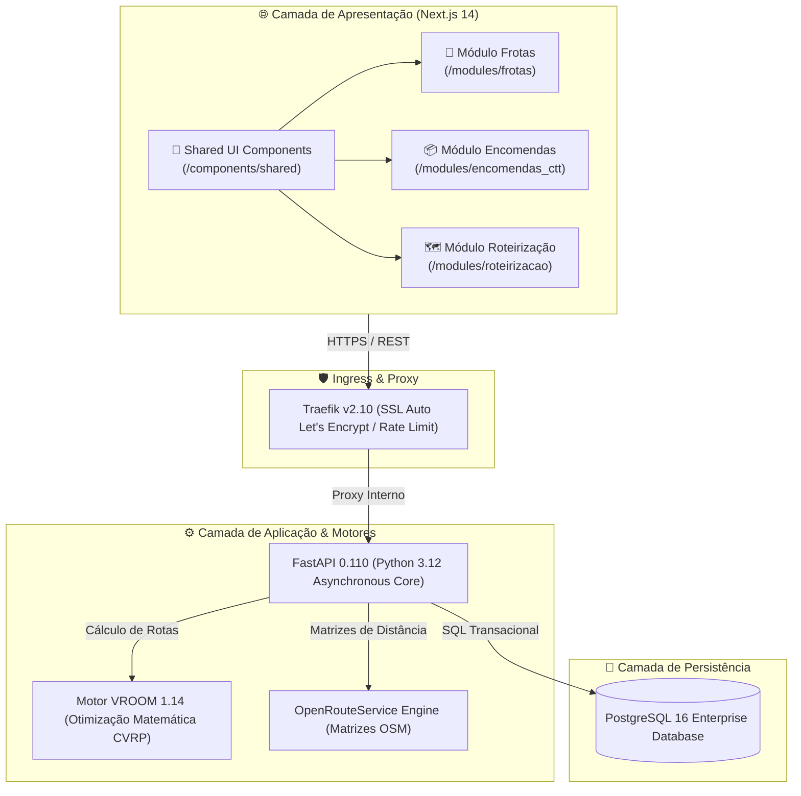

# 📦 Plataforma Logística CTT Express & Roteirização Inteligente

> **Documentação Canônica de Arquitetura e Engenharia da Plataforma**  
> **Versão:** 2.0.0 · **Padrão Arquitetural:** Vertical Slice Architecture + Shared UI System  
> **Stack Operacional:** Next.js 14 + FastAPI + PostgreSQL + VROOM + OpenRouteService + Traefik + Docker Swarm

---

## 🗺️ 1. Visão Geral da Plataforma

A **Plataforma Logística CTT** é um sistema de missão crítica para gestão integrada de encomendas, monitorização de frota veicular e otimização matemática de rotas de entrega postal no território de Portugal continental e ilhas.

O sistema foi desenhado sob o princípio de **Fatias Verticais Autônomas (Vertical Slice Architecture)**, eliminando o acoplamento excessivo das arquiteturas em camadas tradicionais e garantindo que cada módulo funcional contenha tudo o que precisa para operar, mantendo uma camada transversal estrita de **Componentes Compartilhados (Shared UI)** para consistência visual e ergonômica.



---

## 🏛️ 2. Motores Open Source (O "Coração" da Aplicação)

Ao contrário de sistemas convencionais baseados em estimativas manuais, a plataforma utiliza motores open source industriais de alta performance:

| Motor Open Source | Função no Ecossistema CTT | Benefício Real |
| :--- | :--- | :--- |
| **VROOM 1.14** *(Vehicle Routing Open-source Machine)* | Algoritmo determinístico C++ para resolução do problema de roteamento de veículos com janelas de tempo (**VRPTW**) e restrições de capacidade (**CVRP**). | Redução de até **28% na quilometragem percorrida** e equilíbrio automático da carga entre carrinhas elétricas e camiões pesados. |
| **OpenRouteService (ORS)** | Motor de roteamento geográfico baseado em dados cartográficos abertos do **OpenStreetMap (OSM)** de Portugal. | Cálculo exato de matrizes de tempo e distância considerando a malha viária real, vias de sentido único e restrições de velocidade. |
| **FastAPI + Uvicorn** | Framework Python assíncrono de altíssimo rendimento para processamento de payloads e telemetria. | Validação estrita de contratos via Pydantic v2, documentação OpenAPI/Swagger automática e baixa latência (<15ms). |
| **Next.js 14 (App Router)** | Framework React com renderização híbrida (SSR + Client Components) e TailwindCSS. | Carregamento instantâneo, design responsivo com identidade visual CTT (vermelho corporativo `#DA291C`), Dark/Light mode e Offline-First. |
| **Traefik Reverse Proxy** | Roteador de borda com autodescoberta de contêineres Docker Swarm. | Terminação SSL Let's Encrypt automática, roteamento dinâmico por Hostname (`ctt.vpsconexao.org`) e proteção contra falhas. |
| **Docker Swarm** | Orquestrador leve nativo para clusters VPS. | Alta disponibilidade, reinicialização automática de serviços com falha e zero downtime durante rolling updates. |

---

## 🏗️ 3. Arquitetura de Código: Fatias Verticais & Shared UI

### 3.1. Fatias Verticais (`frontend/modules/`)
Cada módulo é autossuficiente e encapsula sua própria lógica de negócio, tipos, hooks e componentes locais:

```
frontend/modules/
├── frotas/
│   ├── types.ts          # Definições de tipos do domínio da frota
│   ├── useFrotas.ts      # Hook de dados, cache e mutações CRUD
│   └── FrotasView.tsx    # Interface completa do módulo de frota
├── encomendas_ctt/
│   ├── types.ts          # Contratos de tracking, pesos e destinatários
│   ├── useEncomendas.ts  # Hook com tolerância a falhas (fallback offline)
│   └── EncomendasView.tsx# Interface operacional de encomendas CTT
└── roteirizacao/
    ├── types.ts          # Estruturas de paragens, distâncias e algoritmos
    ├── useRoteirizacao.ts# Hook de orquestração de rotas
    └── RoteirizacaoView.tsx# Painel de controle e despacho de rotas
```

### 3.2. Componentes Compartilhados (`frontend/components/shared/`)
Garantem conformidade visual e usabilidade estrita sem replicação de HTML/CSS:
- **`Modal.tsx`**: Diálogo flutuante centrado com backdrop escuro (`bg-slate-950/70 backdrop-blur-sm`), tecla `ESC`, clique externo e travamento de scroll no body.
- **`ConfirmDialog.tsx`**: Diálogo padronizado de confirmação para ações destrutivas (remoção com soft-delete auditado).
- **`FormField.tsx`**: Tratamento unificado de rótulos, campos obrigatórios e exibição de mensagens de validação.

---

## 🔄 4. Ciclos de Vida Operacionais

### 4.1. Ciclo de Encomenda CTT
1. **Registo:** Atribuição de Tracking ID único (ex: `DA123456789PT`), morada completa, código postal português (ex: `1000-001`) e peso em kg.
2. **Triagem no Hub:** Alocação ao Centro de Distribuição mais próximo.
3. **Despacho:** Inclusão na rota diária de um veículo da frota.
4. **Entrega/Incidência:** Baixa em tempo real com auditoria de data e hora.

### 4.2. Otimização de Rota (VROOM)
1. O despachante seleciona a lista de encomendas pendentes para uma região.
2. O sistema agrupa os pontos de paragem e submete a matriz de coordenadas ao VROOM.
3. O algoritmo calcula a sequência ideal de paragens minimizando a distância e o tempo estimado de entrega.
4. A rota é alocada a uma carrinha disponível com capacidade volumétrica suficiente.

---

## 🚀 5. Operação e Manutenção em Produção

- **Ambiente:** VPS HostEurope (`167.86.69.79`)
- **Acesso Web Seguro:** `https://ctt.vpsconexao.org`
- **Portainer Swarm Admin:** `https://portainer.vpsconexao.org`
- **Banco de Dados:** PostgreSQL porta interna `5432` na rede de overlay `traefik-public`.
- **Logs e Telemetria:** `docker service logs -f ctt_web`
