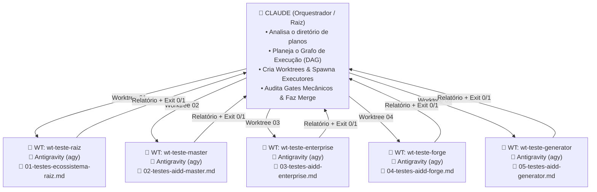

# 🐋 Orquestração ORCA ADE: Claude (Orquestrador) + Antigravity (Executores em Worktrees)

> **Local Canônico:** `docs/features/orquestracao-orca-ade/`  
> **Status:** Em Construção / Alinhamento de Design  
> **Data:** 06/09/2026  
> **Idioma Oficial:** Português do Brasil (PT-BR)  

---

## 1. Visão Geral e Arquitetura

O modelo implementa o conceito de **Mesas Isoladas (Worktrees Git)** do **ORCA ADE**, com separação estrita entre governança/orquestração e execução de tarefas.

---

## 2. Papéis e Responsabilidades

| Agente / Papel | Ambiente | Responsabilidades |
| :--- | :--- | :--- |
| **Claude Code (Orquestrador)** | Repositório Raiz (`main` ou branch ativa) | - Decompor os planos da pasta alvo. - Gerar o plano de orquestração mestre. - Gerenciar o ciclo de vida das worktrees git (`create`, `audit`, `merge`, `remove`). - Monitorar Quality Gates globais e compilar o relatório executivo. |
| **Antigravity CLI (Executores)** | Worktree Isolada (`../wt-<nome>`) | - Executar tarefas específicas fatiadas (ex.: suítes de testes ou geração de código). - Sem contaminação de contexto (consome apenas o markdown da sua frente). - Garantir gates locais (`exit 0`) antes de sinalizar conclusão. |

---

## 3. Exemplo Prático de Aplicação: Testes Completos do Ecossistema

- **Pasta Alvo:** `docs/planos/testes-completos-ecossistema/`
- **Frentes Identificadas:**
  1. `01-testes-ecossistema-raiz.md` → Mesa Raiz
  2. `02-testes-aidd-master.md` → Mesa AIDD-Master
  3. `03-testes-aidd-enterprise.md` → Mesa AIDD-Enterprise
  4. `04-testes-aidd-forge.md` → Mesa AIDD-Forge
  5. `05-testes-aidd-generator.md` → Mesa AIDD-Generator

---

## 4. Próximos Passos: Futura Skill e CLI

- **Destino da Skill:** `componentes/compartilhado/skills/orca-plan-orchestrator/`
- **Slash Command Previsto:** `/orchestrate <caminho-da-pasta>`
- **Scripts Auxiliares:**
  - `parse_plan_dir.py`: Varredura estática de arquivos numerados (00, 01, 02...).
  - `generate_orchestration_doc.py`: Geração automática do arquivo `PLANO-ORQUESTRACAO-ORCA3-*.md`.
  - `run_worktree_triad.py`: Mecanismo que automatiza o git worktree, subprocessos dos agentes e verificação de gates mecânicos.
