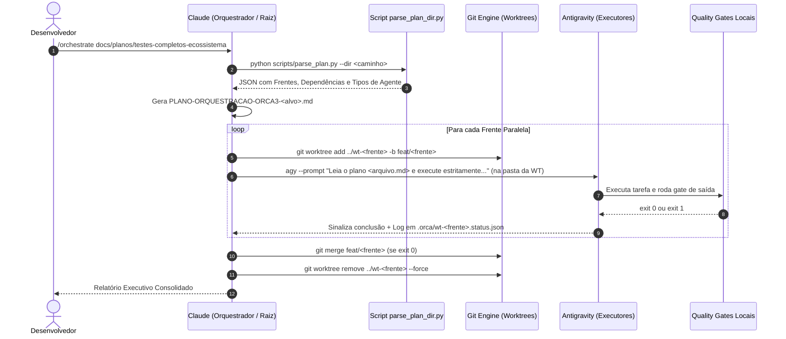

# ⚙️ Detalhamento Técnico: Processo, Comandos Exatos e Agnosticidade da Skill

> **Local Canônico:** `docs/features/orquestracao-orca-ade/02-detalhamento-processo-comandos-e-agnosticidade.md`  
> **Status:** Documentação Técnica Detalhada  
> **Data:** 06/09/2026  
> **Idioma Oficial:** Português do Brasil (PT-BR)  

---

## 1. Escopo e Agnosticidade: Universal vs Específica?

A skill foi concebida para ser **100% Universal e Agnóstica**, operando sobre qualquer diretório que contenha um plano estruturado, seja dentro do ecossistema AIDD ou em projetos externos.

### O Contrato Universal de Entrada (Schema do Plano):
A skill aceita qualquer diretório que siga a convenção de arquivos numerados:
```
<diretorio-do-plano>/
├── 00-PROCESSO-E-DECISOES.md    (Contexto global, regras de ouro, premissas)
├── 01-<frente-a>.md            (Especificação da Frente A)
├── 02-<frente-b>.md            (Especificação da Frente B)
└── 03-<frente-c>.md            (Especificação da Frente C)
```
- **Flexibilidade de Caminho:** Aceita caminho relativo (`docs/planos/testes-completos-ecossistema`), caminho absoluto (`C:/Projetos/OutroApp/planos/v2`) ou `.` (diretório atual).
- **Agnosticidade de Tarefa:** A skill não sabe nem se importa se o plano é de *testes*, *refatoração*, *migração de banco* ou *criação de microserviços*. Ela apenas interpreta o contrato de frentes independentes e orquestra a execução.

---

## 2. Ciclo de Vida e Lógica de Execução da Skill



---

## 3. Comandos Exatos Disparados em Cada Etapa

Abaixo estão os comandos reais executados pelo **Claude** (via PowerShell no Windows):

### Etapa 1: Análise Estática e Parse do Plano (Zero Tokens de LLM)
```powershell
# Executado na raiz do repositório
python componentes/compartilhado/skills/orca-plan-orchestrator/scripts/parse_plan.py `
  --dir "C:/Users/trcnologia/Desktop/ecossistema-aidd/docs/planos/testes-completos-ecossistema" `
  --output "docs/features/orquestracao-orca-ade/plano-execucao-ativo.json"
```
*Saída gerada:* Um JSON determinístico listando cada arquivo, dependências (se roda após o arquivo anterior ou em paralelo) e o diretório de trabalho alvo.

---

### Etapa 2: Criação das Mesas Isoladas (Git Worktrees)
Para cada frente que pode rodar em paralelo:
```powershell
# Cria a branch temporária e a pasta isolada fora da árvore de trabalho principal
git worktree add ../wt-teste-raiz -b orca/teste-raiz
git worktree add ../wt-teste-master -b orca/teste-master
git worktree add ../wt-teste-enterprise -b orca/teste-enterprise
git worktree add ../wt-teste-forge -b orca/teste-forge
git worktree add ../wt-teste-generator -b orca/teste-generator
```

---

### Etapa 3: Disparo dos Agentes nas Mesas (via Catálogo `harness_profiles.json`)
O Claude (ou o script `agent_spawner.py`) não hardcodeia comandos. Ele lê as flags customizadas do usuário configuradas para cada harness (ex.: `--dangerously-skip-permissions`, `--yolo`, `--pure`, modelos específicos como `gemini-3.8-flash-low`, `xiaomi-token-plan/mimo-v2.5`, `sonnet`, `big-pickle`), gravando a saída em logs individuais:

```powershell
# Exemplo Mesa Master (Antigravity com modelo e skip de permissões customizadas)
Start-Process -NoNewWindow -FilePath "powershell" -ArgumentList @(
  "-Command",
  "cd ../wt-teste-master; " +
  "agy --model gemini-3.8-flash-low --dangerously-skip-permissions --prompt 'Você é o Executor Especialista da Mesa Master. Leia estritamente o arquivo docs/planos/testes-completos-ecossistema/02-testes-aidd-master.md e execute todos os passos descritos. Ao finalizar, gere o relatório em orca-report.json e garanta exit 0.' > ../wt-teste-master/exec.log 2>&1"
)

# Exemplo Mesa Enterprise (MimoCode com flags headless yolo e modelo customizado)
Start-Process -NoNewWindow -FilePath "powershell" -ArgumentList @(
  "-Command",
  "cd ../wt-teste-enterprise; " +
  "mimo --yolo --pure -m xiaomi-token-plan/mimo-v2.5 -p 'Você é o Executor Especialista da Mesa Enterprise. Leia o plano 03...' > ../wt-teste-enterprise/exec.log 2>&1"
)
```

> **Por que perfis dinâmicos de harness?**  
> Ver detalhamento completo em [07-perfis-harnesses-e-flags-customizadas.md](file:///C:/Users/trcnologia/Desktop/ecossistema-aidd/docs/features/orquestracao-orca-ade/07-perfis-harnesses-e-flags-customizadas.md). Isso garante que o agente nunca fique travado aguardando confirmação interativa no terminal em background e utilize exatamente as LLMs e quotas configuradas pelo usuário.

---

### Etapa 4: Monitoramento e Auditoria dos Quality Gates
O Claude inspeciona o estado das worktrees consultando arquivos de status:

```powershell
# Verificar se os processos terminaram e se os gates passaram
python componentes/compartilhado/skills/orca-plan-orchestrator/scripts/check_status.py `
  --worktrees "../wt-teste-raiz", "../wt-teste-master", "../wt-teste-enterprise", "../wt-teste-forge", "../wt-teste-generator"
```

Critério de Aceite:
- Cada mesa deve emitir `status: "SUCCESS"` e `exit_code: 0`.
- Se uma mesa falhar (`exit_code: 1`), o Claude inspeciona `exec.log` daquela mesa específica e despacha uma instrução de correção apenas para ela.

---

### Etapa 5: Merge Atômico e Purge das Mesas
Após todos os gates estarem verdes (`exit 0`):

```powershell
# 1. Trazer as alterações validadas para a branch principal
git merge --no-ff orca/teste-raiz -m "orca(raiz): execucao plano 01 concluida com sucesso"
git merge --no-ff orca/teste-master -m "orca(master): execucao plano 02 concluida com sucesso"
git merge --no-ff orca/teste-enterprise -m "orca(enterprise): execucao plano 03 concluida com sucesso"
git merge --no-ff orca/teste-forge -m "orca(forge): execucao plano 04 concluida com sucesso"
git merge --no-ff orca/teste-generator -m "orca(generator): execucao plano 05 concluida com sucesso"

# 2. Excluir as pastas de worktree físicas
git worktree remove ../wt-teste-raiz --force
git worktree remove ../wt-teste-master --force
git worktree remove ../wt-teste-enterprise --force
git worktree remove ../wt-teste-forge --force
git worktree remove ../wt-teste-generator --force

# 3. Excluir as branches temporárias
git branch -D orca/teste-raiz orca/teste-master orca/teste-enterprise orca/teste-forge orca/teste-generator
```

---

## 4. Resumo da Lógica Interna da Skill

| Componente | Função | Dependência Externa |
| :--- | :--- | :--- |
| **`SKILL.md`** | Declaração do comando `/orchestrate`, parâmetros (`--dir`, `--parallel`, `--dry-run`) e persona do Orquestrador. | Nenhuma |
| **`parse_plan.py`** | Parser Python que extrai do Markdown os blocos de comando, premissas e dependências. | Apenas Python padrão (`re`, `pathlib`, `json`) |
| **`worktree_manager.py`** | Wrapper seguro de `git worktree` com tratamento de concorrência e limpeza garantida (`finally`). | Git CLI |
| **`agent_launcher.py`** | Disparador agnóstico de CLI (`agy`, `claude`, `opencode` ou `hermes`). | CLI do harness instalado |
