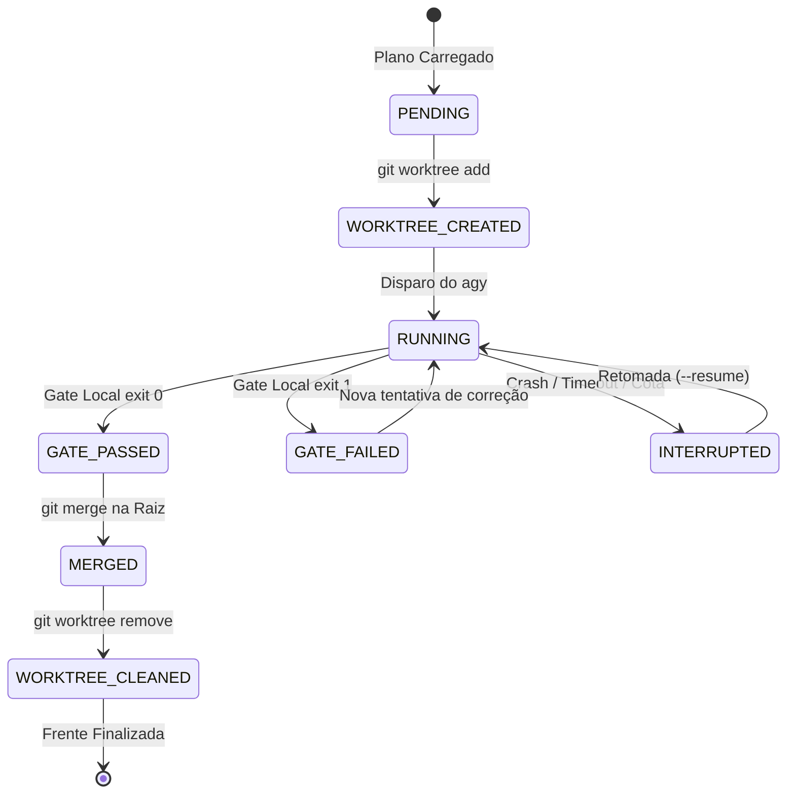

# 🛡️ Persistência, Resiliência e Recuperação de Falhas (Crash Recovery)

> **Local Canônico:** `docs/features/orquestracao-orca-ade/03-persistencia-resiliencia-e-crash-recovery.md`  
> **Status:** Especificação Técnica de Resiliência  
> **Data:** 06/09/2026  
> **Idioma Oficial:** Português do Brasil (PT-BR)  

---

## 1. O Desafio da Volatilidade e Falhas Reais

Em execuções de planos longos com múltiplos agentes em worktrees, eventos adversos são comuns:
1. **Estouro de Cota / Rate Limit da API do LLM** (HTTP 429, créditos esgotados, limite de RPM/TPM).
2. **Queda de Energia ou Desligamento Abrupto da Máquina**.
3. **Morte de Processo do Terminal / Fechamento do Harness**.

> **Regra Fundamental de Governança AIDD:**  
> *O estado do ecossistema nunca deve viver apenas na memória volátil da sessão de chat. Ele deve ser persistido atomicamente em disco (Write-Ahead Log).*

---

## 2. A Dupla Camada de Persistência: `memory.md` + `.orca_state.json`

Para garantir tanto **legibilidade humana/LLM** quanto **determinismo mecânico de máquina**, a orquestração utiliza dois arquivos sincronizados na pasta de trabalho do plano (ou em `.orca/`):

```
docs/features/orquestracao-orca-ade/ (ou diretório do plano ativo)
├── memory.md            <-- Visão Executiva em PT-BR (Human-Readable & LLM Prompt)
└── .orca_state.json     <-- Estado Determinístico / Machine-Readable (Zero-Token Parser)
```

### 2.1. Estrutura Canônica do `memory.md`

Este arquivo é atualizado atomicamente após **cada transição de estado** de qualquer mesa de trabalho:

```markdown
# 🧠 MEMORY: Estado de Execução da Orquestração ORCA 3
> **Plano Alvo:** `docs/planos/testes-completos-ecossistema`  
> **Última Atualização:** 2026-09-06T12:45:00-03:00  
> **Status Global:** EM ANDAMENTO (3/5 concluídos)  

| # | Frente | Worktree | Branch | Status | Exit Code | Commit SHA | Último Checkpoint |
|---|---|---|---|---|---|---|---|
| 01 | Raiz | `../wt-teste-raiz` | `orca/teste-raiz` | ✅ CONCLUÍDO | 0 | `a1b2c3d` | Testes executados e mergeado |
| 02 | Master | `../wt-teste-master` | `orca/teste-master` | ✅ CONCLUÍDO | 0 | `e4f5g6h` | Gate validado e mergeado |
| 03 | Enterprise | `../wt-teste-enterprise` | `orca/teste-enterprise` | ⏳ EM ANDAMENTO | - | `i7j8k9l` | Rodando step 4: test_licensing |
| 04 | Forge | `../wt-teste-forge` | `orca/teste-forge` | ⏸️ PENDENTE | - | - | Aguardando liberação |
| 05 | Generator | `../wt-teste-generator` | `orca/teste-generator` | ⏸️ PENDENTE | - | - | Aguardando liberação |

## 📝 Diário de Bordo & Incidentes
- [12:35] Orquestração iniciada pelo Claude.
- [12:40] Frente 01 concluída com exit code 0. Merge efetuado.
- [12:42] Frente 02 concluída com exit code 0. Merge efetuado.
- [12:44] Frente 03 iniciada na worktree ../wt-teste-enterprise.
```

### 2.2. Estrutura Determinística do `.orca_state.json`

```json
{
  "plan_id": "testes-completos-ecossistema",
  "started_at": "2026-09-06T12:35:00-03:00",
  "updated_at": "2026-09-06T12:45:00-03:00",
  "global_status": "IN_PROGRESS",
  "frentes": {
    "01-testes-ecossistema-raiz": {
      "status": "MERGED",
      "exit_code": 0,
      "worktree_path": "../wt-teste-raiz",
      "branch": "orca/teste-raiz",
      "commit_sha": "a1b2c3d4",
      "error": null
    },
    "02-testes-aidd-master": {
      "status": "MERGED",
      "exit_code": 0,
      "worktree_path": "../wt-teste-master",
      "branch": "orca/teste-master",
      "commit_sha": "e4f5g6h7",
      "error": null
    },
    "03-testes-aidd-enterprise": {
      "status": "RUNNING",
      "exit_code": null,
      "worktree_path": "../wt-teste-enterprise",
      "branch": "orca/teste-enterprise",
      "commit_sha": "i7j8k9l0",
      "error": null
    },
    "04-testes-aidd-forge": {
      "status": "PENDING",
      "exit_code": null,
      "worktree_path": null,
      "branch": null,
      "commit_sha": null,
      "error": null
    },
    "05-testes-aidd-generator": {
      "status": "PENDING",
      "exit_code": null,
      "worktree_path": null,
      "branch": null,
      "commit_sha": null,
      "error": null
    }
  }
}
```

---

## 3. Máquina de Estados e Ciclo de Transição

Cada frente de trabalho transita obrigatoriamente pelos seguintes estados:



---

## 4. Protocolo de Recuperação (Crash Recovery / Resume)

Se a luz cair, a máquina reiniciar ou a cota de tokens estourar, o desenvolvedor (ou agente) simplesmente invoca:

```powershell
# Execução do comando de retomada
python ecossistema.py orchestrate docs/planos/testes-completos-ecossistema --resume
# Ou via Slash Command no Claude / Antigravity:
/orchestrate docs/planos/testes-completos-ecossistema --resume
```

### O que o Script faz automaticamente ao retomar (`--resume`):

1. **Leitura Imediata (Zero Tokens):** Lê `.orca_state.json` e `memory.md`.
2. **Reconciliação com o Git:**
   - Executa `git worktree list` e `git branch` para checar se as pastas físicas e branches ainda existem no disco.
3. **Ações de Recuperação por Estado:**
   - Se a frente está como **`MERGED`**: Ignora completamente (não gasta tokens nem refaz nada).
   - Se a frente está como **`GATE_PASSED`** (mas não mergeada): Executa o `git merge` pendente e limpa a worktree.
   - Se a frente está como **`RUNNING`** ou **`INTERRUPTED`**:
     - Verifica se o processo `agy` ainda está rodando no SO (`Get-Process`).
     - Se morreu, lê o último `exec.log` da worktree para ver onde parou.
     - Spawna o `agy` naquela mesa com a instrução: *"Retome a execução a partir do último checkpoint registrado no log..."*.
   - Se a frente está como **`PENDING`**: Segue a fila normal.

---

## 5. Tratamento Específico de Estouro de Cota (Rate Limit)

Quando a API do LLM retorna código `429 (Too Many Requests)` ou mensagem de cota:

1. **Detecção no Agente Executor (`agy`):** O processo local captura o erro de cota.
2. **Registro Imediato no `memory.md`:** 
   - Status alterado para `PAUSED_QUOTA`.
   - Registra o horário exato e o tempo estimado de espera.
3. **Estratégia de Backoff:**
   - O orquestrador não destrói a worktree; ela permanece intacta com todo o código produzido até o momento.
   - O usuário pode reiniciar mais tarde ou trocar de modelo/chave e dar `--resume` sem perder 1 único arquivo já criado.
