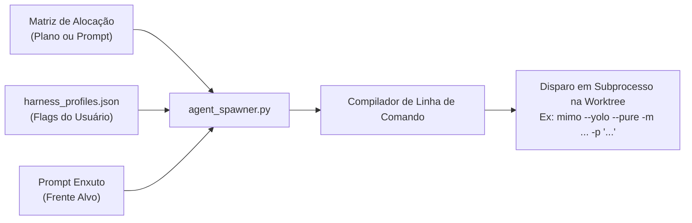

# 🎛️ Perfis de Harnesses e Injeção de Flags Customizadas do Usuário

> **Local Canônico:** `docs/features/orquestracao-orca-ade/07-perfis-harnesses-e-flags-customizadas.md`  
> **Status:** Especificação de Parametrização e Configuração Dinâmica  
> **Data:** 06/09/2026  
> **Idioma Oficial:** Português do Brasil (PT-BR)  

---

## 1. O Problema: Por que NUNCA Hardcodear Flags de CLI no Script?

Cada desenvolvedor possui:
- Flags de autonomia e bypass de permissão (`--dangerously-skip-permissions`, `--yolo`, `--auto`).
- Modelos customizados, endpoints locais ou provedores específicos (`-m xiaomi-token-plan/mimo-v2.5`, `-m opencode/big-pickle`, `--model gemini-3.8-flash-low`).
- Recursos adicionais de harness (ex.: `--chrome`, `--pure`, `--thinking`).

Se o motor do ORCA hardcodeasse `agy --prompt ...`, ele quebraria o workflow do usuário e travaria pedindo permissões interativas no terminal em background.

---

## 2. A Solução Arquitetural: Catálogo de Perfis de Harness (`harness_profiles.json`)

O motor de disparo (`agent_spawner.py`) desacopla **a intenção de execução** da **sintaxe física do comando**, utilizando um arquivo de configuração declarativo em:
`componentes/compartilhado/skills/orca-plan-orchestrator/config/harness_profiles.json` (ou `.orca/harness_profiles.json` na raiz do usuário/projeto).

### 2.1. Estrutura Canônica do Catálogo:

```json
{
  "$schema": "https://json-schema.org/draft/2020-12/schema",
  "default_harness": "antigravity",
  "harnesses": {
    "antigravity": {
      "bin": "agy",
      "default_flags": [
        "--model", "gemini-3.8-flash-low",
        "--dangerously-skip-permissions"
      ],
      "prompt_flag": "--prompt",
      "headless": true
    },
    "mimo": {
      "bin": "mimo",
      "default_flags": [
        "--yolo",
        "--pure",
        "-m", "xiaomi-token-plan/mimo-v2.5"
      ],
      "prompt_flag": "-p",
      "headless": true
    },
    "claude": {
      "bin": "claude",
      "default_flags": [
        "--dangerously-skip-permissions",
        "--chrome",
        "--model", "sonnet"
      ],
      "prompt_flag": "-p",
      "headless": true
    },
    "opencode": {
      "bin": "opencode",
      "default_flags": [
        "--auto",
        "--pure",
        "-m", "opencode/big-pickle"
      ],
      "prompt_flag": "-p",
      "headless": true
    }
  }
}
```

---

## 3. Como Isso Altera a Etapa 3 (Disparo nas Mesas)?

Em vez de disparar uma string fixa, o `agent_spawner.py` executa o **Compilador de Comando do Harness**:



### 3.1. Fórmula de Composição da Linha de Comando:
```
[BIN] + [FLAGS_DO_PERFIL] + [OVERRIDES_DO_USUARIO] + [PROMPT_FLAG] + [PROMPT_FATURADO]
```

### 3.2. Exemplo Real de Comandos Compilados e Disparados:

| Mesa / Alvo | Harness Escolhido | Comando Realmente Executado no SO (na pasta da Worktree) |
| :--- | :--- | :--- |
| **Mesa Raiz** | `claude` | `claude --dangerously-skip-permissions --chrome --model sonnet -p "Você é o executor da frente 01-raiz..." > exec.log 2>&1` |
| **Mesa Master** | `antigravity` | `agy --model gemini-3.8-flash-low --dangerously-skip-permissions --prompt "Você é o executor da frente 02-master..." > exec.log 2>&1` |
| **Mesa Enterprise** | `mimo` | `mimo --yolo --pure -m xiaomi-token-plan/mimo-v2.5 -p "Você é o executor da frente 03-enterprise..." > exec.log 2>&1` |
| **Mesa Forge** | `opencode` | `opencode --auto --pure -m opencode/big-pickle -p "Você é o executor da frente 04-forge..." > exec.log 2>&1` |

---

## 4. Como o Usuário Personaliza suas Flags?

O usuário tem 3 níveis de personalização com precedência estrita:

1. **Nível 1 (Permanente):** Edita o `harness_profiles.json` uma única vez com suas preferências do ambiente local.
2. **Nível 2 (Por Plano):** Declara na tabela do `00-PROCESSO-E-DECISOES.md` uma coluna de flags extras para aquela demanda específica.
3. **Nível 3 (Linguagem Natural no Prompt):**
   > *"Orquestre o plano X. Para o Claude passe a flag `--chrome` e use Sonnet; para o Antigravity use `--model gemini-3.8-flash-low` e pule permissões."*
   O parser identifica os parâmetros e aplica o override em tempo de execução.
