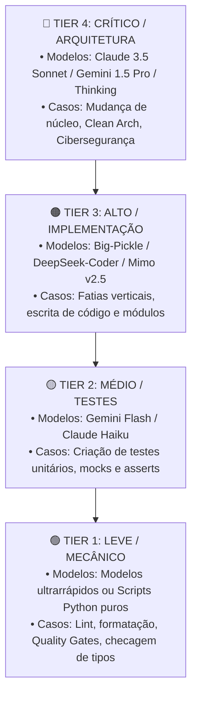

# 📊 Dinâmica do Catálogo: Tiers de Complexidade, Construção e Portão de Aprovação

> **Local Canônico:** `docs/features/orquestracao-orca-ade/08-dinamica-do-catalogo-tiers-complexidade-e-aprovacao.md`  
> **Status:** Especificação de Governança e Experiência do Usuário (UX)  
> **Data:** 06/09/2026  
> **Idioma Oficial:** Português do Brasil (PT-BR)  

---

## 1. O Catálogo Pode Ser Modificado pelo Usuário?

**Sim, 100%.** O catálogo **não é uma caixa-preta travada**. Ele é um arquivo JSON/YAML aberto e editável localizado em:
- Global: `~/.orca/harness_profiles.json` (preferências do desenvolvedor na máquina).
- Local do Projeto: `.orca/harness_profiles.json` (override específico do repositório).

O usuário pode editar manualmente via VS Code/editor de texto ou através de um comando assistido:
```powershell
python ecossistema.py harness configure
```

---

## 2. Como Ele é Construído? (Auto-Discovery + Scaffold)

O catálogo é construído através de uma rotina determinística em 3 etapas:

1. **Auto-Discovery Mecânico (Zero Tokens):**
   - O script `harness_detector.py` varre o `PATH` do sistema operacional procurando os executáveis instalados (`Get-Command agy, claude, mimo, opencode, hermes`).
2. **Scaffold com Defaults Inteligentes:**
   - Detecta as ferramentas presentes na máquina e pré-preenche as flags não interativas padrão (`--dangerously-skip-permissions`, `--yolo`, `--auto`).
3. **Persistência Declarativa:**
   - Salva o arquivo local para que o usuário revise e adicione suas chaves/modelos favoritos.

---

## 3. É Dinâmico por Complexidade e Uso Computacional ou Fixo?

**Totalmente Dinâmico.** O catálogo organiza os harnesses em **Tiers de Capacidade Computacional e Raciocínio (Compute/Reasoning Tiers)**:



### 3.1. Exemplo do Catálogo com Tiers de Complexidade:

```json
{
  "compute_tiers": {
    "critical": {
      "preferred_harness": "antigravity",
      "model": "gemini-3.5-pro",
      "flags": ["--dangerously-skip-permissions"]
    },
    "heavy": {
      "preferred_harness": "mimo",
      "model": "xiaomi-token-plan/mimo-v2.5",
      "flags": ["--yolo", "--pure"]
    },
    "medium": {
      "preferred_harness": "opencode",
      "model": "opencode/big-pickle",
      "flags": ["--auto", "--pure"]
    },
    "light": {
      "preferred_harness": "antigravity",
      "model": "gemini-3.8-flash-low",
      "flags": ["--dangerously-skip-permissions"]
    }
  }
}
```

Quando o parser lê o plano (ex.: `02-testes-aidd-master.md`), ele avalia a complexidade da frente e associa automaticamente ao **Tier correspondente**.

---

## 4. O Usuário Pode Aprovar ou Modificar Antes de Iniciar?

**Sim, obrigatoriamente (Portão de Aprovação Interativo / Flight Plan).**

Antes de criar qualquer Git Worktree ou gastar 1 único token de LLM, o orquestrador gera e apresenta no terminal o **Plano de Voo da Orquestração (Dry-Run Preview)**:

```
================================================================================
✈️ PLANO DE VOO DA ORQUESTRAÇÃO ORCA 3
Plano Alvo: docs/planos/testes-completos-ecossistema (5 Frentes Detectadas)
================================================================================

| # | Frente | Complexidade | Harness Alocado | Modelo Selecionado | Flags Injetadas |
|---|---|---|---|---|---|
| 01 | Raiz | Light | Antigravity | gemini-3.8-flash-low | --dangerously-skip-permissions |
| 02 | Master | Heavy | MimoCode | xiaomi-token-plan/mimo-v2.5 | --yolo --pure |
| 03 | Enterprise | Critical | Antigravity | gemini-3.5-pro | --dangerously-skip-permissions |
| 04 | Forge | Medium | OpenCode | opencode/big-pickle | --auto --pure |
| 05 | Generator | Heavy | MimoCode | xiaomi-token-plan/mimo-v2.5 | --yolo --pure |

💰 Estimativa de Custo de Tokens: Otimizado (70% das frentes em modelos econômicos)
🌱 Worktrees a serem criadas: 5 (efêmeras, serão purgadas após exit 0)

--------------------------------------------------------------------------------
Opções:
[ENTER / 's'] Confirmar e Iniciar Execução Imediata
['m'] Modificar alocação de alguma mesa (ex.: '02 claude sonnet')
['c'] Cancelar
Sua escolha: _
```

### 4.1. Modificação On-the-Fly em Linguagem Natural
Se o usuário digitar:
> *"Quero mudar a mesa 02 para usar Claude com Sonnet e a mesa 04 com Gemini Flash"*

O sistema recompila a tabela em menos de 1 segundo e solicita a confirmação final. Nada roda sem a autorização expressa do desenvolvedor.
