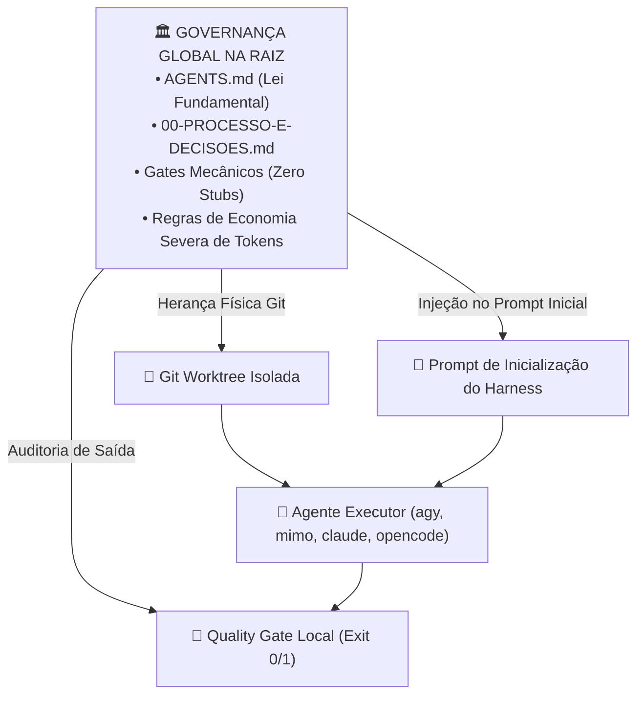

# 🏛️ Herança Rigorosa de Governança, Regras e Economia Severa de Tokens

> **Local Canônico:** `docs/features/orquestracao-orca-ade/09-heranca-de-governanca-regras-e-economia-de-tokens.md`  
> **Status:** Lei Fundamental de Execução em Mesas Isoladas  
> **Data:** 06/09/2026  
> **Idioma Oficial:** Português do Brasil (PT-BR)  

---

## 1. Princípio Fundamental: Herança Estrita (Zero-Deviation)

Os agentes operando nas Git Worktrees **SEGUEM RIGOROSAMENTE TODAS AS REGRAS E DECISÕES DO PROJETO DE FORMA HERDADA**.

Eles **jamais operam no escuro** ou em modo genérico. O isolamento de uma worktree é **exclusivamente de arquivos em edição e histórico de chat**, nunca de governança ou diretrizes arquiteturais.



---

## 2. As 3 Camadas de Herança Automática

### Camada 1: Herança Física e Arquitetural (Via Git Worktree)
Como a Git Worktree é uma ramificação física do mesmo repositório, o agente ao acordar dentro da pasta da worktree (`../wt-<nome>/`) encontra **automaticamente** todos os arquivos de configuração do ecossistema:
- `AGENTS.md` (Governança, determinismo, zero stubs).
- `CLAUDE.md`, `.cursor/rules/`, `.agent/`, `.gemini/` (Regras de comportamento e skills).
- Diretório `gates/` (Meta-Quality Gates prontos para validação).
- Ferramenta de build e CLI (`ecossistema.py`).

### Camada 2: Injeção do "Contexto Mestre" no Prompt de Inicialização
Quando o `agent_spawner.py` aciona o harness (`agy`, `mimo`, `claude`), ele injeta obrigatoriamente no prompt inicial:
1. **O conteúdo integral do arquivo `00-PROCESSO-E-DECISOES.md`** (que define as decisões de design, padrões e premissas daquela suíte).
2. **A Diretiva de Economia Severa de Tokens (Tríade Caveman Ultra):**
   - Pensamento interno telegráfico (Caveman Thinking: sem artigos desnecessários, foco imediato na causa-raiz).
   - Saídas de terminal estritamente concisas em PT-BR.
   - Proibição de reescrever arquivos completos quando apenas um diff ou patch é necessário.
3. **A Regra Anti-Stub:**
   - Código 100% real e funcional. Proibido `TODO`, `pass`, `# mock temporário` ou simulações falsas.

### Camada 3: Enforcement Binário via Quality Gates (A Barreira Mecânica)
Mesmo que um LLM tente "alucinar" ou ignorar as diretrizes herdadas:
- O agente **não consegue concluir a mesa**.
- Ao tentar finalizar a tarefa, o script `gate_auditor.py` executa os gates locais:
  - `python gates/G_ECOSSISTEMA_INTEGRIDADE.py`
  - `python gates/G_COMPONENTE_AGNOSTICO.py`
  - `pytest` com 100% de aprovação.
- Se violar qualquer diretriz herdada, o gate retorna `exit 1`, o commit é bloqueado e a worktree **nunca é mergeada na raiz**.

---

## 3. Exemplo do Prompt Herdado Injetado pelo Spawner:

```markdown
[DIRETIVA DE GOVERNANÇA AIDD - ORCA ADE]
Você está operando em uma mesa de trabalho isolada (Worktree Git) para a frente: {frente_id}.

REGRAS DE OURO OBRIGATÓRIAS HERDADAS:
1. ECONOMIA SEVERA DE TOKENS: Raciocínio interno telegráfico (Caveman). Respostas concisas em PT-BR.
2. ZERO STUBS: Implementações completas, tipadas e testadas. Zero placeholders.
3. CONTEXTO MESTRE OBRIGATÓRIO: Leia e obedeça integralmente às premissas de {arquivo_00}.
4. QUALIDADE DETERMINÍSTICA: Sua entrega só será aceita se o Quality Gate local retornar exit 0.

Seu escopo de trabalho está estritamente delimitado em: {arquivo_frente}.
```

---

## 4. Conclusão: Isolamento com Alinhamento Total

- **O que é isolado?** O consumo de tokens, a memória volátil da conversa e a árvore de arquivos temporária.
- **O que é herdado e compartilhado?** 100% da governança, das leis de engenharia agêntica, da economia de tokens, das regras de arquitetura e dos Quality Gates do projeto.
