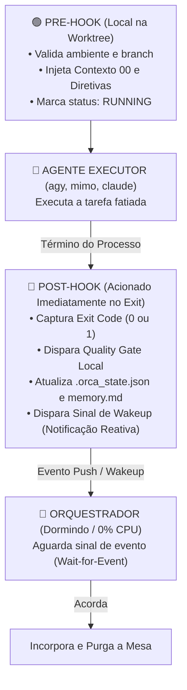

# 🪝 Arquitetura de Hooks Reativos (Pre-Hooks e Post-Hooks): Zero Polling e Zero Desperdício

> **Local Canônico:** `docs/features/orquestracao-orca-ade/10-arquitetura-hooks-reativos-pre-e-pos-execucao.md`  
> **Status:** Especificação de Arquitetura Reativa Orientada a Eventos  
> **Data:** 06/09/2026  
> **Idioma Oficial:** Português do Brasil (PT-BR)  

---

## 1. O Problema do Polling Passivo (Busy-Wait)

Sem hooks, o agente auditor/orquestrador precisaria rodar em loop (ex.: `while True: sleep(5)`), inspecionando processos no SO:
- Desperdiça ciclos de CPU e memória RAM.
- Corre o risco de travar se o terminal do orquestrador for suspenso.
- Cria latência desnecessária entre o término do agente e o início do merge.

---

## 2. A Solução: Arquitetura Orientada a Eventos com Pre e Post Hooks

Em vez de **perguntar repetidamente se terminou (Polling)**, o sistema adota o padrão **"Me avise quando terminar" (Push / Event-Driven)**.



---

## 3. Como os Hooks São Implementados Mecanicamente

O orquestrador **não dispara o binário do agente solto**. Ele dispara uma **Cadeia de Comandos Atômica** encapsulada pelo sistema operacional:

### 3.1. Sintaxe de Execução da Cadeia (PowerShell / Bash):
```powershell
python hooks/pre_hook.py --frente 02-master; `
agy --model gemini-3.8-flash-low --prompt '...'; `
$exit_code = $LASTEXITCODE; `
python hooks/pos_hook.py --frente 02-master --exit-code $exit_code
```

### 3.2. O Ciclo do Pre-Hook (`hooks/pre_hook.py`):
1. Confirma que a pasta da worktree está montada corretamente.
2. Injeta o arquivo `00-PROCESSO-E-DECISOES.md` e regras de ouro na raiz da worktree.
3. Atualiza atomicamente o `.orca_state.json` para `status: "RUNNING"`.
4. Registra o timestamp inicial para cálculo de telemetria e custo.

### 3.3. O Ciclo do Post-Hook (`hooks/pos_hook.py`):
Disparado **no microssegundo em que o processo do agente encerra**:
1. **Captura do Exit Code:** Verifica se o harness finalizou com sucesso ou erro.
2. **Auditoria Local Automática:** Roda os Quality Gates daquela frente (`python gates/G_LOCAL.py`).
3. **Persistência Atômica:** Grava o status (`GATE_PASSED` ou `GATE_FAILED`) no `.orca_state.json` e atualiza a linha correspondente no `memory.md`.
4. **Disparo do Sinal de Wakeup (Sinalizador Reativo):**
   - Cria um arquivo gatilho `.orca/events/<frente>.done` ou envia uma notificação IPC/Named Pipe.
   - O orquestrador (que estava pausado aguardando o arquivo) acorda instantaneamente para fazer o merge.

---

## 4. Tabela Comparativa: Polling vs Hooks Reativos

| Aspecto | Modelo Tradicional (Polling) | Modelo Reativo com Hooks (ORCA ADE) |
| :--- | :--- | :--- |
| **Consumo de RAM/CPU** | Contínuo (processos de checagem a cada 5s) | **Zero** durante a execução do executor |
| **Latência de Resposta** | Depende do intervalo de sleep (5s a 30s) | **Instantânea** (disparo imediato no exit) |
| **Resiliência a Quedas** | Se o orquestrador cair, o executor fica órfão | O Post-Hook grava o status mesmo sem orquestrador |
| **Qualidade da Auditoria** | Auditor precisa auditar externamente | A própria mesa se auto-audita via Post-Hook |

---

## 5. Hooks Customizados pelo Usuário

O desenvolvedor pode definir scripts adicionais em `.orca/hooks/`:
- `pre-exec.sh / pre-exec.ps1`: Ex.: Iniciar um container Docker de banco para os testes daquela mesa.
- `post-exec.sh / post-exec.ps1`: Ex.: Enviar notificação no Discord/Slack/Telegram dizendo *"Mesa 02 finalizada em 3 minutos com exit code 0"*.
