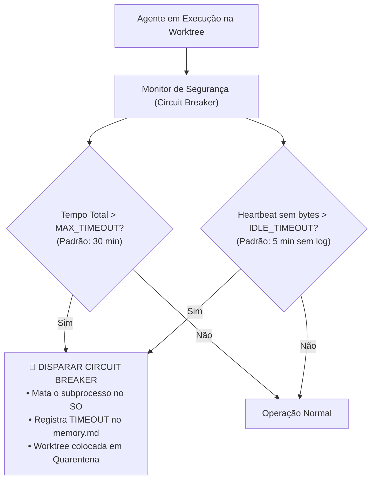

# ⏱️ Circuit Breaker e Timeouts de Segurança: Prevenção Anti-Loop e Proteção de Cotas

> **Local Canônico:** `docs/features/orquestracao-orca-ade/12-circuit-breaker-e-timeouts-de-seguranca.md`  
> **Status:** Especificação de Segurança Operacional e Tolerância a Falhas  
> **Data:** 06/09/2026  
> **Idioma Oficial:** Português do Brasil (PT-BR)  

---

## 1. O Risco: Agentes Presos em Loop ou Trava de I/O

Durante execuções de frentes complexas em background, podem ocorrer situações anômalas:
1. Um harness entra em loop de raciocínio infinito ou tenta executar uma ferramenta que não retorna.
2. Um script de teste fica aguardando input interativo (*stdin*) indefinidamente.
3. Consumo descontrolado de tokens de LLM e gasto financeiro desnecessário.

---

## 2. A Solução: Arquitetura de Circuit Breaker em 2 Níveis

O motor do ORCA ADE implementa um **Circuit Breaker com Heartbeat Ativo**:



---

## 3. Configuração Declarativa no Catálogo de Perfis

Os limites de proteção são configuráveis globalmente ou por tier em `harness_profiles.json`:

```json
{
  "circuit_breaker": {
    "max_execution_time_seconds": 1800,
    "idle_heartbeat_seconds": 300,
    "max_self_healing_retries": 3,
    "on_timeout": "quarantine"
  }
}
```

- **`max_execution_time_seconds` (1800s / 30 min):** Tempo teto absoluto para qualquer frente isolada.
- **`idle_heartbeat_seconds` (300s / 5 min):** Se o arquivo `exec.log` da worktree não receber nenhum novo caractere por 5 minutos, presume-se trava de processo.
- **`max_self_healing_retries` (3 tentativas):** Número máximo de correções automáticas antes de desistir e pedir intervenção humana.

---

## 4. O que Acontece Quando o Circuit Breaker Dispara?

1. **Interrupção Limpa do Processo:** O subprocesso é finalizado no SO (`taskkill` no Windows / `kill -9` no Linux).
2. **Atualização Transacional do Estado:**
   - `.orca_state.json`: `status: "TIMEOUT"`, `error: "Circuit breaker acionado por inatividade/tempo excedido"`.
   - `memory.md`: Linha da mesa marcada como `⚠️ TIMEOUT (Retida em Quarentena)`.
3. **Não-Bloqueio da Esteira:** As demais mesas continuam executando normalmente. A orquestração não morre por causa de um agente travado.
4. **Alerta ao Desenvolvedor:** Notificação clara no relatório executivo final para que o desenvolvedor possa inspecionar o log e decidir se reexecuta com `--resume`.
