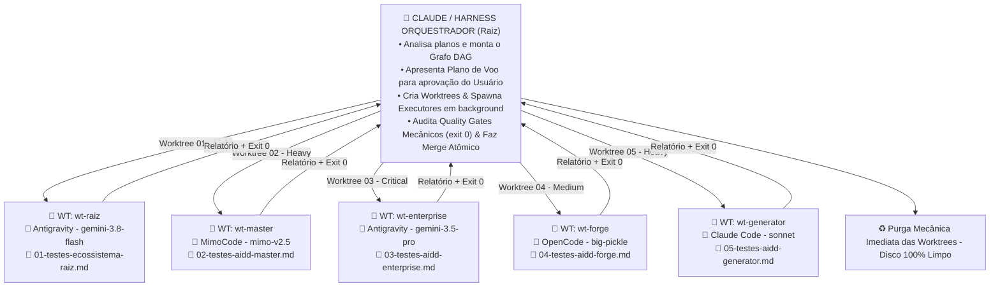

# 🐋 MANUAL UNIFICADO: ORQUESTRACAO ORCA ADE & SKILL UNIVERSAL
> **Guia Definitivo e Consolidado de Engenharia Agêntica**  
> **Local Canônico:** `docs/features/orquestracao-orca-ade/MANUAL-UNIFICADO-ORQUESTRACAO-ORCA-ADE.md`  
> **Status:** Ativo / Unificado (Documento Único de Referência)  
> **Data:** 06/09/2026  
> **Idioma Oficial:** Português do Brasil (PT-BR)  

---

## 🧭 1. Resumo Executivo e Visão Geral

Este documento unifica integralmente as decisões, arquiteturas, comandos, resiliência e diretrizes de governança discutidas para a criação da **Skill Universal de Orquestração ORCA ADE** (`/orchestrate`) no ecossistema AIDD.

### O Que é o Sistema?
Um motor de orquestração multi-agente que pega **qualquer diretório contendo planos estruturados** (ex.: `docs/planos/testes-completos-ecossistema`), decompõe as frentes em um grafo de execução (DAG), aloca **Mesas Isoladas de Trabalho (Git Worktrees efêmeras)** para diferentes ferramentas CLI (`agy`, `mimo`, `claude`, `opencode`) e gerencia a execução com **tolerância total a falhas (crash recovery)**, **zero tokens desperdiçados** em tarefas mecânicas e **auditoria determinística estrita** via Quality Gates.



---

## 🌐 2. Universalidade e Agnosticidade da Skill

A skill **não é limitada a testes** e **não é presa ao caminho atual**. Ela opera sobre qualquer plano estruturado em qualquer repositório:

### Contrato de Entrada (Schema do Plano):
```
<qualquer-diretorio-de-plano>/
├── 00-PROCESSO-E-DECISOES.md    # Contexto Mestre (regras, arquitetura, decisões herdadas)
├── 01-<nome-da-frente>.md       # Escopo específico da Mesa 01
├── 02-<nome-da-frente>.md       # Escopo específico da Mesa 02
└── 03-<nome-da-frente>.md       # Escopo específico da Mesa 03
```
- **Flexibilidade de Caminho:** Aceita caminhos relativos (`docs/planos/meu-plano`), absolutos (`C:/Projetos/App/planos`) ou o diretório atual (`.`).
- **Natureza Agnóstica:** Funciona para suítes de testes, refatorações, migrações de banco, geração de microserviços ou auditorias de segurança.

---

## ♻️ 3. Ciclo de Vida Efêmero das Worktrees (Mesas Descartáveis)

As Git Worktrees são **mesas de trabalho cirúrgicas temporárias**. Elas nunca se acumulam nem viram permanentes:

```
[1. NASCIMENTO]  git worktree add ../wt-<frente> -b orca/<frente>
       │
[2. OPERAÇÃO]    Agente executa tarefa fatiada e isolada (sem poluir a raiz)
       │
[3. AUDITORIA]   Gate mecânico roda localmente (testes reais + tipagem + exit 0)
       │
       ├─► Aprovado 100% (exit 0) ──► [4. MERGE]   git merge --no-ff orca/<frente>
       │                                   │
       │                              [5. PURGA]   git worktree remove ../wt-<frente> --force
       │                                           git branch -D orca/<frente>
       │                                           (Disco 100% limpo)
       │
       └─► Falhou (exit 1) ──────────► [QUARENTENA] Retry pontual; se persistir,
                                                    rollback sem tocar na branch principal.
```

---

## 🛡️ 4. Resiliência, Persistência e Crash Recovery (Idempotência Total)

Quedas de energia, fechamentos de terminal ou estouro de cotas de API (HTTP 429) **não causam perda de trabalho**.

### Dupla Camada de Estado:
1. **`memory.md` (Human/LLM-Readable):** Tabela em Markdown exibindo o progresso visual de cada frente, branch, commit SHA e diário de bordo com horários.
2. **`.orca_state.json` (Machine-Readable):** Máquina de estados determinística manipulada em Python com **zero tokens**, contendo os estados de cada mesa: `PENDING`, `RUNNING`, `GATE_PASSED`, `MERGED`, `FAILED`, `PAUSED_QUOTA`.

### Retomada Automática (`--resume`):
```powershell
python ecossistema.py orchestrate <caminho-do-plano> --resume
# Ou via Slash Command no chat:
/orchestrate <caminho-do-plano> --resume
```
- Frentes já com status **`MERGED`** são sumariamente ignoradas (zero tokens gastos).
- Frentes **`GATE_PASSED`** (com merge pendente) são mergeadas e limpas imediatamente.
- Frentes que estavam **`RUNNING`** no momento da queda têm o último `exec.log` analisado e são retomadas exatamente do ponto de interrupção.
- Em caso de **Rate Limit (Cota Esgotada)**: A mesa fica retida intacta com todo o código produzido; ao restabelecer a cota, o processo continua sem refazer nada.

---

## 🎛️ 5. Catálogo Declarativo de Perfis de Harness e Flags Personalizadas

O sistema **jamais hardcodeia strings de comando**. As preferências de CLI do usuário ficam registradas no arquivo aberto `.orca/harness_profiles.json`:

```json
{
  "$schema": "https://json-schema.org/draft/2020-12/schema",
  "default_harness": "antigravity",
  "harnesses": {
    "antigravity": {
      "bin": "agy",
      "default_flags": ["--model", "gemini-3.8-flash-low", "--dangerously-skip-permissions"],
      "prompt_flag": "--prompt"
    },
    "mimo": {
      "bin": "mimo",
      "default_flags": ["--yolo", "--pure", "-m", "xiaomi-token-plan/mimo-v2.5"],
      "prompt_flag": "-p"
    },
    "claude": {
      "bin": "claude",
      "default_flags": ["--dangerously-skip-permissions", "--chrome", "--model", "sonnet"],
      "prompt_flag": "-p"
    },
    "opencode": {
      "bin": "opencode",
      "default_flags": ["--auto", "--pure", "-m", "opencode/big-pickle"],
      "prompt_flag": "-p"
    }
  }
}
```

### Compilador de Linha de Comando do Spawner:
$$\text{Comando Executado} = \text{[Binário]} + \text{[Flags do Perfil / Autonomia]} + \text{[Flag do Prompt]} + \text{"Prompt Fatiado"}$$
- Com flags como `--dangerously-skip-permissions`, `--yolo` e `--auto`, os subprocessos rodam em background **sem travar pedindo confirmações manuais no terminal**.

---

## 📊 6. Tiers de Complexidade e Economia Extrema de Tokens

O catálogo permite a alocação dinâmica de poder computacional de acordo com o desafio técnico da frente:

| Tier | Grau de Complexidade | Modelos Recomendados | Casos de Uso Típicos |
| :--- | :--- | :--- | :--- |
| **Tier 4 (Critical)** | Raciocínio Profundo | Gemini 1.5/3.5 Pro, Claude 3.5 Sonnet, Thinking | Mudança de arquitetura de núcleo, cibersegurança, contratos de API |
| **Tier 3 (Heavy)** | Implementação Completa | Mimo v2.5, Big-Pickle, DeepSeek-Coder | Fatias verticais, escrita de módulos de negócio, pipelines |
| **Tier 2 (Medium)** | Testes e Integração | Gemini Flash, Claude Haiku | Suítes de testes unitários, mocks de infraestrutura |
| **Tier 1 (Light)** | Operações Mecânicas | Scripts Python puros / Modelos ultrarrápidos | Linting, formatação, Quality Gates, auditoria de hashes |

---

## ✈️ 7. Portão de Aprovação do Usuário (Plano de Voo Interativo)

Nada roda no escuro. Antes de criar qualquer pasta ou gastar tokens, o orquestrador exibe o **Plano de Voo** e bloqueia aguardando confirmação:

```
================================================================================
✈️ PLANO DE VOO DA ORQUESTRAÇÃO ORCA 3
Plano: docs/planos/testes-completos-ecossistema (5 Frentes Detectadas)
================================================================================
| # | Frente | Complexidade | Harness Alocado | Modelo Selecionado | Flags Injetadas |
|---|---|---|---|---|---|
| 01 | Raiz | Light | Antigravity | gemini-3.8-flash-low | --dangerously-skip-permissions |
| 02 | Master | Heavy | MimoCode | xiaomi-token-plan/mimo-v2.5 | --yolo --pure |
| 03 | Enterprise | Critical | Antigravity | gemini-3.5-pro | --dangerously-skip-permissions |
| 04 | Forge | Medium | OpenCode | opencode/big-pickle | --auto --pure |
| 05 | Generator | Heavy | MimoCode | xiaomi-token-plan/mimo-v2.5 | --yolo --pure |

[ENTER / 's'] Confirmar e Iniciar  |  ['m'] Modificar Alocação  |  ['c'] Cancelar
Sua escolha: _
```
O usuário pode ajustar tudo em linguagem natural: *"Mude a mesa 02 para Claude com Sonnet"* — o sistema recompila a tabela instantaneamente.

---

## 🏛️ 8. Herança Rigorosa de Governança (Zero-Deviation)

Os agentes executores operando nas worktrees **não agem como agentes genéricos**. Eles herdam compulsoriamente:

1. **Herança Física:** Como a worktree é um branch Git da raiz, ela contém `AGENTS.md`, `CLAUDE.md`, regras do Cursor, a CLI `ecossistema.py` e todos os Quality Gates da pasta `gates/`.
2. **Injeção do Contexto Mestre:** O arquivo `00-PROCESSO-E-DECISOES.md` é embutido no prompt inicial de cada mesa.
3. **Tríade Caveman Ultra:** Pensamento interno telegráfico, saídas concisas em PT-BR e proibição estrita de desperdício de tokens.
4. **Regra Anti-Stub:** É expressamente proibido código incompleto, stubs ou `# TODO`. Tudo deve ter tipagem estrita e testes reais validados pelo gate local.

---

## ⚙️ 9. Arquitetura da Suíte de Scripts Determinísticos Python

O motor da skill é 100% desacoplado de LLM para tarefas mecânicas (**Zero Token Fallacy**), residindo em:
`componentes/compartilhado/skills/orca-plan-orchestrator/scripts/`

```
├── orchestrator_cli.py    # Ponto de entrada CLI (ecossistema.py orchestrate)
├── plan_parser.py         # Parser estático de markdowns (00, 01, 02) e montador do Grafo DAG
├── state_engine.py        # Gravação atômica de .orca_state.json e renderizador do memory.md
├── worktree_engine.py     # Gerenciador do ciclo de vida efêmero (add, merge, remove, prune)
├── agent_spawner.py       # Compilador de comandos de CLI e launcher de processos headless
└── gate_auditor.py        # Auditor binário de Quality Gates (exit 0 / exit 1)
```

### Comandos de Operação via Terminal / Chat:

```powershell
# Início padrão com aprovação interativa
python ecossistema.py orchestrate docs/planos/testes-completos-ecossistema

# Modo não interativo (já aprovado)
python ecossistema.py orchestrate docs/planos/testes-completos-ecossistema --yes

# Retomada pós-queda de energia ou renovação de cota
python ecossistema.py orchestrate docs/planos/testes-completos-ecossistema --resume

# Simulação sem criar pastas nem gastar tokens
python ecossistema.py orchestrate docs/planos/testes-completos-ecossistema --dry-run
```

Ou no chat de qualquer harness:
```
/orchestrate docs/planos/testes-completos-ecossistema
/orchestrate docs/planos/testes-completos-ecossistema --resume
```

---

## 🪝 10. Arquitetura de Hooks Reativos (Pre-Hooks e Post-Hooks): Zero Polling e Zero Desperdício

Para evitar que o orquestrador/auditor fique em loop ativo (*busy-wait* / polling) consumindo CPU e memória enquanto os agentes trabalham:

```
[Orquestrador Spawna a Mesa com Cadeia Atômica]
         │
         ▼
[PRE-HOOK Local] ──► Injeta Contexto 00 + Marca status RUNNING
         │
         ▼
[AGENTE EXECUTOR] ──► Opera isolado na Worktree
         │
         ▼
[POST-HOOK Local] ──► Disparado IMEDIATAMENTE no Exit do Processo:
                      1. Captura exit code ($LASTEXITCODE)
                      2. Executa Quality Gates locais
                      3. Grava .orca_state.json e memory.md
                      4. Emite Sinal Reativo de Wakeup (Push Event)
         │
         ▼
[ORQUESTRADOR ACORDA] ──► Realiza o Merge e a Purga da Worktree
```

### Vantagens dos Hooks:
- **Zero Consumo de CPU/RAM em Espera:** O orquestrador entra em modo de espera de evento do sistema operacional.
- **Latência Zero:** Não há atraso de *sleep*; o Post-Hook roda no exato microssegundo em que o agente conclui sua execução.
- **Auto-Auditoria Descentralizada:** A própria mesa valida seus gates locais antes de acionar o orquestrador.

---

## 🛡️ 11. Blindagem de Casos de Borda: Conflitos de Merge, Logs e Variáveis de Ambiente

Para operação infalível em ambientes de produção:

1. **Prevenção de Conflitos de Merge:**
   - Cada frente possui fronteiras estritas de arquivos em seu markdown (Princípio de Segregação).
   - O orquestrador aplica uma **Fila de Merge Serializada (`MergeQueue`)**, incorporando uma branch por vez com rebase/merge limpo, eliminando conflitos concorrentes.

2. **Preservação de Logs Pós-Purga (Auditoria Forense):**
   - Antes de qualquer worktree ser destruída (`git worktree remove --force`), o **Post-Hook** copia compulsoriamente os logs da execução e relatórios JSON para `.orca/logs/<frente_id>.log` e `.orca/reports/<frente_id>.json`.
   - O disco e o Git ficam limpos, mas o histórico permanece 100% auditável.

3. **Propagação Segura de Variáveis de Ambiente (`.env`):**
   - O **Pre-Hook** replica seletivamente variáveis de ambiente e configurações locais para dentro da worktree e adiciona esses caminhos ao `.git/info/exclude` da mesa.
   - Os agentes conseguem rodar testes que exigem credenciais sem jamais vazar ou comitar segredos no repositório.

---

## ⏱️ 12. Circuit Breaker e Timeouts de Segurança (Anti-Loop e Proteção de Cotas)

Para evitar que um agente trave indefinidamente ou queime créditos de API em loops:

1. **Monitoramento por Heartbeat:**
   - Se o arquivo de log da worktree (`exec.log`) não receber novos bytes durante um intervalo configurável (ex.: 5 minutos), presume-se trava de I/O ou espera indevida de stdin.
2. **Tempo Limite Máximo (Max Timeout):**
   - Nenhuma frente pode exceder o tempo teto estabelecido (ex.: 30 minutos).
3. **Ação do Circuit Breaker:**
   - O processo é finalizado no sistema operacional (`kill`).
   - A mesa é colocada em estado de **Quarentena** e registrada como `TIMEOUT` no `memory.md`.
   - **A esteira global não é interrompida**: as demais worktrees continuam executando e mergeando normalmente.


