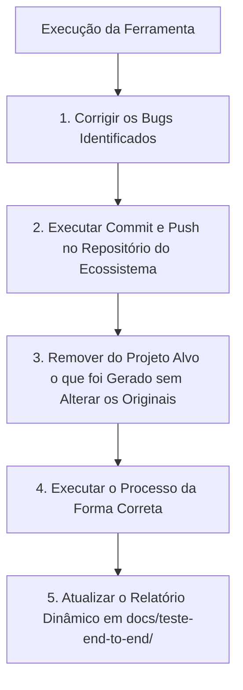

# Protocolo Canônico de Testes e Validação de Ferramentas AIDD

> **Status:** OBRIGATÓRIO (Em vigor a partir de 16/09/2026)  
> **Aplicação:** Todo ciclo de teste, validação e execução ferramenta a ferramenta no ecossistema AIDD.

---

## Ciclo Obrigatório de 5 Passos Pós-Execução

Após o término da execução de qualquer ferramenta do ecossistema no projeto alvo, o agente DEVE seguir estritamente os 5 passos na ordem abaixo:

### 1. Corrigir os Bugs (Auto-Correção Iterativa Obrigatória)
- **Auto-correção até 100% de Conformidade:** Executar ciclo contínuo de diagnóstico, correção e auditoria até que a taxa de conformidade atinja 100% e ZERO inconsistências permaneçam no alvo.
- Identificar a causa raiz (template desatualizado, violação de regra de tokens, syntax error, etc.).
- Corrigir o código fonte ou os templates no repositório do ecossistema (`tools/aidd-*`).
- Rodar a suite de testes unitários da ferramenta até garantir aprovação total antes de avançar.

### 2. Commit e Push das Correções
- Fazer o stage (`git add`) das correções no repositório `ecossistema-aidd`.
- Criar mensagem de commit semântica e determinística descrevendo o fix.
- Realizar o `git push` para a branch remota correspondente.

### 3. Limpeza Cirúrgica do Projeto Alvo
- Remover do projeto alvo exclusivamente o que foi gerado pela ferramenta.
- Garantir 100% de integridade e imutabilidade dos arquivos originais pré-existentes.

### 4. Execução da Forma Correta
- Reexecutar a ferramenta utilizando o fluxo limpo, com zero fricção.
- Executar a auditoria e qualidade correspondente (`audit`, gates) para validar 100% de conformidade.

### 5. Atualização do Relatório Dinâmico
- Documentar no relatório em `docs/teste-end-to-end/relatorio-teste-end-to-end.md`:
  - Nome da ferramenta
  - Objetivo da ferramenta
  - Pasta foco
  - O que executou
  - Como executou (comandos exatos)
  - O que entregou (com referências clicáveis)
  - Erros, bugs e inconsistências: nome, motivo, o que ocasionou, plano de correção e status final.
