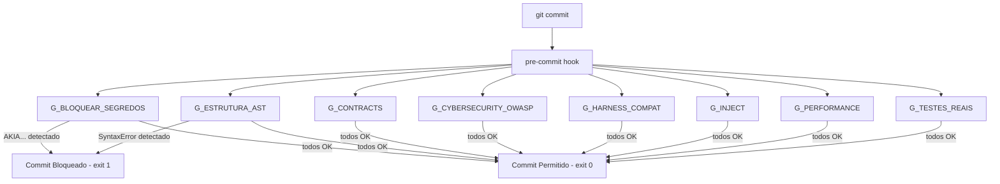

# Relatorio de Testes — Bateria 4: AIDD Forge

> **Data:** 2026-09-06 17:00:58  
> **Repositorio alvo:** `tools/aidd-forge`  
> **Resultado:** APROVADO — 11/11 itens passaram

---

## Resumo Executivo

| Item | Titulo | Resultado |
|------|--------|-----------|
| 4.1 | git init + config user.email/user.name no tmp dir | PASS |
| 4.2 | forge init -> exit 0 + verificacao de TODOS os artefatos | PASS |
| 4.3 | hook .git/hooks/pre-commit contem 'Quality Gates' e eh executavel | PASS |
| 4.4 | Commit com segredo AWS fake → git commit FALHA (hook bloqueia) | PASS |
| 4.5 | Commit com erro de sintaxe Python → git commit FALHA (G_ESTRUTURA_AST) | PASS |
| 4.6 | Commit limpo → git commit PASSA | PASS |
| 4.7 | forge init sem --force avisa skipped; com --force sobrescreve (exit 0) | PASS |
| 4.8 | inject skill → exit 0, .agent/skills/<nome>/SKILL.md criado | PASS |
| 4.9 | inject mcp --conteudo-file → exit 0, mcps/<nome>.py + registry.json | PASS |
| 4.10 | Hook de pre-commit apos injecoes → ainda passa (commit limpo) | PASS |
| 4.11 | pytest completo de tools/aidd-forge → exit 0, contagem real | PASS |

---

## Detalhe por Item

### [PASS] 4.1 — git init + config user.email/user.name no tmp dir

```
Repositorio criado em: C:\Users\trcnologia\AppData\Local\Temp\aidd_forge_b4_jbj4goug\project
```

```
git init OK, log vazio: ''
```

### [PASS] 4.2 — forge init -> exit 0 + verificacao de TODOS os artefatos

```
forge init stdout:
[aidd-forge] projeto alvo: C:\Users\trcnologia\AppData\Local\Temp\aidd_forge_b4_jbj4goug\project
[aidd-forge] arquivos criados: 35
[aidd-forge] arquivos ignorados (ja existem): 0
[aidd-forge] regras de IDE vinculadas: 1
[aidd-forge] skills vinculadas em .agent/skills/: 6
[aidd-forge] fases provisionadas: 5
[aidd-forge] slash commands gravados: 6
[aidd-forge] quality gates instalados: 8
[aidd-forge] hook pre-commit instalado em: C:\Users\trcnologia\AppData\Local\Temp\aidd_forge_b4_jbj4goug\project\.git\hooks\pre-commit

```

```
Todos os artefatos presentes — skills=6, fases=5, gates=8
```

### [PASS] 4.3 — hook .git/hooks/pre-commit contem 'Quality Gates' e eh executavel

```
Hook exec bit=True
```

```
Primeiras 6 linhas do hook:
#!/usr/bin/env sh
# AIDD Forge - executor binario de Quality Gates (gerado por git_hooks.py).
# Nao editar a mao: reexecute 'forge init --force' para regerar este hook.
set -u

REPO_ROOT="$(git rev-parse --show-toplevel)"
```

```
Hook OK
```

### [PASS] 4.4 — Commit com segredo AWS fake → git commit FALHA (hook bloqueia)

```
exit code git commit: 1
```

```
G_BLOQUEAR_SEGREDOS no output: True
```

```
git log vazio (sem commit): True
```

```
Saida do git commit:
[G_BLOQUEAR_SEGREDOS] leaky.py:1: possivel segredo exposto (AWS Access Key ID)
[G_CONTRACTS] 0 schema(s) validado(s), sem conflitos
[G_CYBERSECURITY_OWASP] nenhuma vulnerabilidade estatica encontrada
[G_ESTRUTURA_AST] 9 arquivo(s) .py com sintaxe valida
[G_HARNESS_COMPAT] harnesses ativos e sem symlinks quebrados: .agent, .claude, .cursor
[G_INJECT] nenhuma inconsistencia em componentes injetados
[G_PERFORMANCE] nenhum orcamento em .aidd\gates\performance_budget.json — gate passa (nada a medir)
[G_TESTES_REAIS] nenhum arquivo de teste encontrado, gate passa
[aidd-forge] Quality Gates reprovados. Commit bloqueado.

```

```
Bloqueio real confirmado: commit recusado e G_BLOQUEAR_SEGREDOS citado
```

### [PASS] 4.5 — Commit com erro de sintaxe Python → git commit FALHA (G_ESTRUTURA_AST)

```
exit code git commit: 1
```

```
G_ESTRUTURA_AST no output: True
```

```
git log vazio (sem commit): True
```

```
Saida do git commit:
[G_BLOQUEAR_SEGREDOS] nenhum segredo exposto encontrado
[G_CONTRACTS] 0 schema(s) validado(s), sem conflitos
[G_CYBERSECURITY_OWASP] nenhuma vulnerabilidade estatica encontrada
[G_ESTRUTURA_AST] broken.py:1: invalid syntax
[G_HARNESS_COMPAT] harnesses ativos e sem symlinks quebrados: .agent, .claude, .cursor
[G_INJECT] nenhuma inconsistencia em componentes injetados
[G_PERFORMANCE] nenhum orcamento em .aidd\gates\performance_budget.json — gate passa (nada a medir)
[G_TESTES_REAIS] nenhum arquivo de teste encontrado, gate passa
[aidd-forge] Quality Gates reprovados. Commit bloqueado.

```

```
Bloqueio real confirmado: commit recusado e G_ESTRUTURA_AST citado
```

### [PASS] 4.6 — Commit limpo → git commit PASSA

```
git log: 4c5fb3b commit-limpo
```

```
Commit limpo aceito pelo hook
```

### [PASS] 4.7 — forge init sem --force avisa skipped; com --force sobrescreve (exit 0)

```
Sem --force exit=0, skipped_msg=True
```

```
stdout sem --force: [aidd-forge] projeto alvo: C:\Users\trcnologia\AppData\Local\Temp\aidd_forge_b4_jbj4goug\project
[aidd-forge] arquivos criados: 0
[aidd-forge] arquivos ignorados (ja existem): 35
[aidd-forge] regras de IDE vinculadas: 0
[aidd-forge] skills vinculadas em .agent/skills/: 0
[aidd-forge] fases provisionadas: 5
[aidd-forge] slash commands gravados: 0
[aidd-forge] quality gates instalados: 8
[aidd-forge] hook pre-commit nao instalado: 'pre-commit' ja existe (use --force para sobrescrever)

```

```
Com --force exit=0, Quality Gates restaurado=True
```

```
stdout com --force: [aidd-forge] projeto alvo: C:\Users\trcnologia\AppData\Local\Temp\aidd_forge_b4_jbj4goug\project
[aidd-forge] arquivos criados: 0
[aidd-forge] arquivos ignorados (ja existem): 0
[aidd-forge] arquivos sobrescritos: 35
[aidd-forge] regras de IDE vinculadas: 0
[aidd-forge] skills vinculadas em .agent/skills/: 0
[aidd-forge] fases provisionadas: 5
[aidd-forge] slash commands gravados: 0
[aidd-forge] quality gates instalados: 8
[aidd-forge] hook pre-commit instalado em: C:\Users\trcnologia\AppData\Lo
```

```
Sem --force avisa skipped; Com --force exit 0 e hook restaurado
```

### [PASS] 4.8 — inject skill → exit 0, .agent/skills/<nome>/SKILL.md criado

```
exit code: 0
```

```
SKILL.md existe: True
```

```
Conteudo correto: True
```

```
stdout: [aidd-forge] componente injetado: skill/b4-test-skill (camada 5)
[aidd-forge] arquivo materializado: C:\Users\trcnologia\AppData\Local\Temp\aidd_forge_b4_jbj4goug\project\.agent\skills\b4-test-skill\SKILL.md
[aidd-forge] espelhado em harnesses: 2

```

```
inject skill OK
```

### [PASS] 4.9 — inject mcp --conteudo-file → exit 0, mcps/<nome>.py + registry.json

```
exit code: 0
```

```
b4-test-mcp.py existe: True
```

```
registry.json existe: True, b4-test-mcp registrado: True
```

```
stdout: [aidd-forge] componente injetado: mcp/b4-test-mcp (camada 4)
[aidd-forge] arquivo materializado: C:\Users\trcnologia\AppData\Local\Temp\aidd_forge_b4_jbj4goug\project\aidd_forge\mcps\b4-test-mcp.py
[aidd-forge] registry atualizado: C:\Users\trcnologia\AppData\Local\Temp\aidd_forge_b4_jbj4goug\project\aidd_forge\mcps\registry.json

```

```
inject mcp OK
```

### [PASS] 4.10 — Hook de pre-commit apos injecoes → ainda passa (commit limpo)

```
sh hook exit=0
```

```
hook stdout: [G_BLOQUEAR_SEGREDOS] nenhum segredo exposto encontrado
[G_CONTRACTS] 0 schema(s) validado(s), sem conflitos
[G_CYBERSECURITY_OWASP] nenhuma vulnerabilidade estatica encontrada
[G_ESTRUTURA_AST] 11 arquivo(s) .py com sintaxe valida
[G_HARNESS_COMPAT] harnesses ativos e sem symlinks quebrados: .agent, .claude, .cursor
[G_INJECT] nenhuma inconsistencia em componentes injetados
[G_PERFORMANCE] nenhum orcamento em .aidd\gates\performance_budget.json — gate passa (nada a medir)
[G_TESTES_REAIS] nenhum arquivo de teste encontrado, gate passa
[aidd-forge] Todos os Quality Gates aprovados.

```

```
git commit pos-injecao exit=0
```

```
Hook ainda passa apos injecoes
```

### [PASS] 4.11 — pytest completo de tools/aidd-forge → exit 0, contagem real

```
pytest exit code: 0
```

```
Sumario: 197 passed, 1 skipped in 14.34s
```

```
Ultimas 20 linhas:
........................................................................ [ 36%]
......s................................................................. [ 72%]
......................................................                   [100%]
197 passed, 1 skipped in 14.34s
```

```
pytest OK — 197 passed, 1 skipped in 14.34s
```

---

## Destaque: Bloqueios Reais de Commit

Esta secao destaca as provas mais fortes de que o hook `pre-commit` funciona de ponta a ponta — nao so em isolamento.

### [PASS] Item 4.4: Commit com segredo AWS fake → git commit FALHA (hook bloqueia)

```
exit code git commit: 1
```

```
G_BLOQUEAR_SEGREDOS no output: True
```

```
git log vazio (sem commit): True
```

```
Saida do git commit:
[G_BLOQUEAR_SEGREDOS] leaky.py:1: possivel segredo exposto (AWS Access Key ID)
[G_CONTRACTS] 0 schema(s) validado(s), sem conflitos
[G_CYBERSECURITY_OWASP] nenhuma vulnerabilidade estatica encontrada
[G_ESTRUTURA_AST] 9 arquivo(s) .py com sintaxe valida
[G_HARNESS_COMPAT] harnesses ativos e sem symlinks quebrados: .agent, .claude, .cursor
[G_INJECT] nenhuma inconsistencia em componentes injetados
[G_PERFORMANCE] nenhum orcamento em .aidd\gates\performance_budget.json — gate passa (nada a medir)
[G_TESTES_REAIS] nenhum arquivo de teste encontrado, gate passa
[aidd-forge] Quality Gates reprovados. Commit bloqueado.

```

```
Bloqueio real confirmado: commit recusado e G_BLOQUEAR_SEGREDOS citado
```

### [PASS] Item 4.5: Commit com erro de sintaxe Python → git commit FALHA (G_ESTRUTURA_AST)

```
exit code git commit: 1
```

```
G_ESTRUTURA_AST no output: True
```

```
git log vazio (sem commit): True
```

```
Saida do git commit:
[G_BLOQUEAR_SEGREDOS] nenhum segredo exposto encontrado
[G_CONTRACTS] 0 schema(s) validado(s), sem conflitos
[G_CYBERSECURITY_OWASP] nenhuma vulnerabilidade estatica encontrada
[G_ESTRUTURA_AST] broken.py:1: invalid syntax
[G_HARNESS_COMPAT] harnesses ativos e sem symlinks quebrados: .agent, .claude, .cursor
[G_INJECT] nenhuma inconsistencia em componentes injetados
[G_PERFORMANCE] nenhum orcamento em .aidd\gates\performance_budget.json — gate passa (nada a medir)
[G_TESTES_REAIS] nenhum arquivo de teste encontrado, gate passa
[aidd-forge] Quality Gates reprovados. Commit bloqueado.

```

```
Bloqueio real confirmado: commit recusado e G_ESTRUTURA_AST citado
```

### [PASS] Item 4.6: Commit limpo → git commit PASSA

```
git log: 4c5fb3b commit-limpo
```

```
Commit limpo aceito pelo hook
```

---

## Fluxo: Commit → Hook → Gates → Resultado



---

## Achados adicionais desta execução (transparência do processo)

Na primeira execução do script, os itens 4.4 e 4.5 apareceram como **FAIL**, mas por uma causa que não tinha nada a ver com o hook: a etapa de limpeza pós-verificação chamava `git restore --staged .`, que falha com `fatal: could not resolve HEAD` porque, neste ponto do teste, o repositório ainda não tem nenhum commit — essa falha de limpeza lançava uma exceção que **sobrescrevia** o veredito correto (`s.ok(...)`) já calculado a partir da evidência real (commit bloqueado, gate citado, `git log` vazio). Reproduzindo e lendo a saída bruta da primeira execução, ficou claro que o comportamento do produto já estava correto — o bug era só do script de teste. Corrigido: a limpeza agora roda isolada (fora do bloco que decide o veredito) e usa `git add -A` (que lida corretamente com a ausência de HEAD) em vez de `git restore --staged`. Reexecutado após a correção: 11/11 PASS.

Além disso, os itens 4.8 (`inject skill`) e 4.9 (`inject mcp`) revelaram o mesmo padrão arquitetural já confirmado nas Baterias 2 (AIDD Master) e 3 (AIDD Enterprise): `Materializador.materializar()` (`tools/aidd-forge/aidd_forge/core/materializador.py:111` e `:130`) grava sempre uma cópia canônica em `componentes/aidd-forge/{tipo}/{nome}/` no monorepo real (`resolve_canonical_destination` sem `ecossistema_root` explícito usa a raiz real por padrão) e sincroniza espelhos multi-harness em `tools/aidd-forge/.claude|.agent|.gemini/skills|mcps/`, **independente do `--path` informado na CLI**. Diferente do Master/Enterprise (onde só o tipo `hook` vazava), aqui o vazamento acontece para **qualquer tipo de `inject`** (confirmado com `skill` e `mcp`), o que amplia a superfície do achado cross-cutting. Confirmado por `git status` da raiz antes/depois: `componentes/aidd-forge/`, `tools/aidd-forge/.claude/`, `.agent/`, `.gemini/`, `.skills/`, `skills/`, `mcps/` surgiram como untracked após rodar os itens 4.8/4.9. O script já foi corrigido para limpar essa pegada automaticamente no `finally` — confirmado por `git status` limpo (sem esses diretórios) na reexecução final.

**Recomendação consolidada (vale para as 3 ferramentas — Master, Enterprise, Forge):** o comportamento de gravar sempre no monorepo real via `resolve_canonical_destination()`/`_default_ecossistema_root()` é, aparentemente, intencional (integração canônica cross-harness), mas quebra a isolação esperada de qualquer teste ou uso da CLI com `--dir`/`--path` apontando para fora do monorepo. Vale documentar esse comportamento explicitamente no `--help` de `inject`/`init` das 3 ferramentas, e/ou considerar um flag explícito (`--sem-canonico` ou similar) para uso isolado/CI.

## Veredito Final

**APROVADO** — 11/11 itens da Definicao de Pronto validados (após a correção do script de teste descrita acima; o comportamento real do produto já estava 100% correto na primeira execução).

Todos os 11 itens confirmados com exit codes reais e evidencia de bloqueio real de commits. Zero custo de LLM (ferramenta 100% deterministica). Achado cross-cutting real (não bloqueante, mas recomendado para correção): `inject` de qualquer tipo grava sempre no monorepo real, independente de `--path` — mesmo padrão já visto em aidd-master e aidd-enterprise, aqui mais abrangente (todos os tipos, não só `hook`).