# Ciclo de Vida do Projeto: Do Prompt ao Sistema Homologado

> **Versão do Framework:** 2.1 (Pós-Elevação para Nota 10.0+ / Homologado)  
> **Para quem é este documento:** Desenvolvedores e engenheiros de DevOps que desejam acompanhar os estados, transições e gates de validação que um projeto atravessa durante sua geração.

---

## 1. Diagrama de Estados do Ciclo de Vida

```mermaid
stateDiagram-v2
    [*] --> IntencaoDetectada: /generate ou Linguagem Natural
    IntencaoDetectada --> PreVoo: IntentRouter valida entrada
    PreVoo --> FrotaResolvida: detector.py & orca_fleet.py
    FrotaResolvida --> Fase1_Pesquisa: Inicia Linha de Montagem
    
    Fase1_Pesquisa --> Fase2_Analise: Dossiê validado
    Fase2_Analise --> Fase3_Design: analise_phase2.json
    Fase3_Design --> Fase4_Decisao: design_aidd_phase3.json
    Fase4_Decisao --> Fase5_Criacao: config_global_local.json
    Fase5_Criacao --> Fase8_Implementacao: Estrutura montada no disco
    
    state Fase8_Implementacao {
        [*] --> DecomposicaoAST
        DecomposicaoAST --> SubagenteEfemero
        SubagenteEfemero --> ValidacaoAST
        ValidacaoAST --> TestePytest
        TestePytest --> Sucesso: Passou
        TestePytest --> AutoCura5Porques: Falhou
        AutoCura5Porques --> SubagenteEfemero: Regenera Micro-task
        Sucesso --> PurgaContexto
    }
    
    Fase8_Implementacao --> Fase6_Documentacao: Código e testes aprovados
    Fase6_Documentacao --> Fase7_AutoCritica: Docs vivos gerados
    Fase7_AutoCritica --> GatesMecanicos: Score final calculado
    
    state GatesMecanicos {
        [*] --> G_BLOQUEAR_SEGREDOS
        G_BLOQUEAR_SEGREDOS --> G_INTEGRACAO_CROSS_SCRIPT
        G_INTEGRACAO_CROSS_SCRIPT --> G_CYBERSECURITY_OWASP
        G_CYBERSECURITY_OWASP --> Aprovado: exit 0
    }
    
    GatesMecanicos --> ProjetoEntregue: Todos os Gates OK
    ProjetoEntregue --> [*]
```

---

## 2. Transições e Critérios de Aceitação

| Estágio | Entrada | Ação Principal | Saída / Critério de Transição |
| :--- | :--- | :--- | :--- |
| **0. Intenção** | Prompt do Usuário | `IntentRouter` / `slash_gen.py` | Ação `gerar_projeto` com confiança ≥ 0.85 |
| **1. Pré-Voo** | Ambiente do Host | `detector.py` | Ferramentas catalogadas em `01_orca_inventory.json` |
| **2. Pesquisa** | Ideia Bruta | `PesquisadorFase1` | Dossiê de requisitos estruturado |
| **3. Análise** | Dossiê | `AnalisadorFase2` (Subagente efêmero) | `analise_phase2.json` com entidades e regras |
| **4. Design** | Análise | `DesignerFase3` (5 subagentes) | `design_aidd_phase3.json` e schemas Draft 2020-12 |
| **5. Decisão** | Design | `DecisorFase4` | Stack e banco SQLite WAL resolvidos |
| **6. Criação** | Decisão | `CriadorProjetoFase5` | Pastas, schemas e linters no disco físico |
| **7. Código** | Estrutura & Schemas | `ImplementadorFase8` com AST | Código Python 100% testado e `Result Monad` |
| **8. Docs** | Código real | `DocumentadorFase6` | `README.md`, docs de API e guias de uso |
| **9. Auditoria** | Projeto montado | `AnalisadorCriticoAutomatico` | Score final de qualidade (0 a 100) |
| **10. Gates** | Todo o repositório | `verificar_gates.py` | Aprovação binária (I3 Cross-Script e OWASP) |
